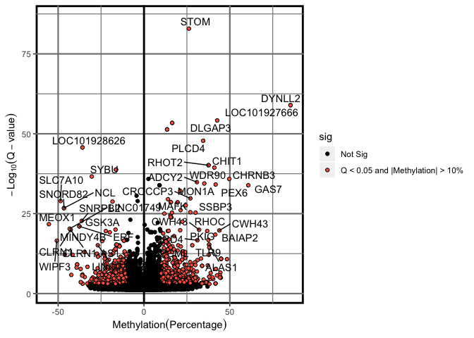

**Author**: Mark E. Pepin, MS, PhD Biomedical Engineering | MD-PhD Trainee
**Contact**: pepinme@gmail.com
**Institution**: University of Alabama at Birmingham
**Location**: 542 Biomedical Research Building 2, Birmingham, AL 35294

# Genome Assembly and Alignment
## Genome Assembly
The first task was to align the bisulfite reduced and sequenced reads to a genome assembly. To accomplish this, an annotated human genome assembly was prepared based on Gencode annotation (gencode.v28.annotation.gtf) and sequence (GRCh38.p12.genome.fa).
`bwameth.py index /data/scratch/pepinme/Napoli/Input/Genome/GRCh38.p12.genome.fa`

The sequencing data were then trimmed and aligned using the following batch script:
## Adapter and Read Quality Trimming
Once the genome assembly was created, adapter sequences were trimmed and sequencing quality assessed via trim_galore and FastQC, respectively.

`trim_galore \`
`-o $INPUT_DIR/fastq_trimmed/ \`
`--paired --rrbs --non_directional --length 20 --fastqc \`
`$INPUT_DIR/fastq/${VAR}_R1_001.fastq.gz $INPUT_DIR/fastq/${VAR}_R2_001.fastq.gz`

## Read Alignment
All .fastq files were then aligned to the genome assemblies using the following command:
`bwameth.py --threads 8 \`
`--reference $GENOME_DIR/GRCh38.p12.genome.fa \`
`$INPUT_DIR/fastq_trimmed/${VAR}_R1_001_val_1.fq.gz $INPUT_DIR/fastq_trimmed/${VAR}_R2_001_val_2.fq.gz \`
`> $RESULTS_DIR/RRBS_bwa/${VAR}.sam`

Once aligned, we converted to .bam output.

### Convert .sam to .bam
`samtools view -S -b $RESULTS_DIR/RRBS_bwa/${VAR}.sam > $RESULTS_DIR/RRBS_bwa/${VAR}.bam`
### Sort using samtools
`samtools sort $RESULTS_DIR/RRBS_bwa/${VAR}.bam -o $RESULTS_DIR/RRBS_bwa/${VAR}.sorted.bam`
### create an index
`samtools index $RESULTS_DIR/RRBS_bwa/${VAR}.sorted.bam`
### MethylDackel
`MethylDackel extract $GENOME_DIR/GRCh38.p12.genome.fa $RESULTS_DIR/RRBS_bwa/${VAR}.sorted.bam -o $RESULTS_DIR/RRBS_bwa/${VAR}.counted --methylKit`

Once finished, the CpG methylation was extracted as both bedgraph file (for UCSC genome browser) and bed file, which was then used to identify differentially-methylated cytosines (DMCs) and differentially-methylated regions (DMRs).

The "*.counted" files that resulted from this process were then read into R (version 3.6.1) and combined into a single "object" for differential methylation analysis

# Differential Methylation Analysis

## Combining sample methylation


```r
#Conditions to be used in differential methylation analysis (FILL OUT)
library(openxlsx)
library(dplyr)
TREATMENT=c("VEH","AZA")
CELL=c("ASC")

ANALYSIS="ASC_AZAvCON"
###  "2" is Pre-LVAD, "3" is Post-LVAD, "1" is CON
library(methylKit)
file.list <- list.files(path = paste0("../1_Input/Methyl/2_bwameth.out/", CELL), pattern = "*.counted_CpG.bedGraph", full.names = TRUE, all.files = TRUE)
#Generate Column names (remove the extra nonsense from the path names)
colnames <- gsub( "*.counted_CpG.bedGraph", "", file.list)
colnames <- gsub( paste0("[.][.]/1_Input/Methyl/2_bwameth.out/", CELL, "/"), "", colnames)
sample_id<-as.list(colnames)
#Import the Index file
Index.raw<-read.xlsx("../1_Input/Index/Index_Napoli.xlsx", sheet = CELL)
Index.raw$Treatment<-factor(Index.raw$Treatment, levels = c("VEH", "AZA"))
# Index.raw$Treatment<-factor(Index.raw$Group, levels = c("CON", "LOW", "HIGH"))

## Sort the index according to the .bed file ordering (as imported). This is important for correct annotation of samples.
Index.raw$Treatment<-as.integer(Index.raw$Treatment)
Index.raw<-Index.raw %>% arrange(Sample.ID)

## Filter according to analysis parameters (CELL and TREATMENT)
Index.subset<-Index.raw
sample_id<-as.list(colnames)
##Create a methlRawlistDB
file.list<-as.list(file.list)
myobj<-methRead(file.list, sample.id = sample_id, assembly = "hg38", treatment = Index.raw$Treatment, pipeline = "bismarkCoverage", header = FALSE, context = "CpG")
##Example of smaple statistics (can spot check these)
getMethylationStats(myobj[[2]], plot = F, both.strands = F)
```

```
## methylation statistics per base
## summary:
##    Min. 1st Qu.  Median    Mean 3rd Qu.    Max. 
##   0.000   0.000   7.692  32.142  73.913 100.000 
## percentiles:
##         0%        10%        20%        30%        40%        50%        60% 
##   0.000000   0.000000   0.000000   0.000000   0.000000   7.692308  26.666667 
##        70%        80%        90%        95%        99%      99.5%      99.9% 
##  61.904762  81.818182  92.307692 100.000000 100.000000 100.000000 100.000000 
##       100% 
## 100.000000
```

```r
#Subset the methylRawList to include only the sample_id's for the desired analysis
myobj_filtered<-reorganize(myobj, sample.ids = Index.subset$Sample.ID, Index.subset$Treatment)
```

Once the samples have been compiled, it is valuable to perform some basic visualizations and statistics to determine whether quality filtering is necessary. The distribution of methylation change is plotted as a histogram (typically bimodal at the extremes), as well as a distribution of the read coverage per based, again plotted as a histogram. For the latter plot, it is important to determine whether PCR duplication biases the read coverage. If so, a secondary peak would emerge on the right-most portion of the histogram. In the current analysis, however, coverage distribution exhibits a one-tailed distribution, lowering concern that the analysis is confounded by PCR amplification bias in coverage.


```r
library(graphics)
getMethylationStats(myobj_filtered[[2]], plot = T, both.strands = F)
```

<!-- -->

```r
getCoverageStats(myobj_filtered[[2]], plot = T, both.strands = F)
```

<!-- -->

```r
#Save these files in an output folder
ifelse(!dir.exists(file.path("../2_Output/", ANALYSIS)), dir.create(file.path("../2_Output/", ANALYSIS)), FALSE)
```

```
## [1] FALSE
```

```r
pdf(file=paste0("../2_Output/", ANALYSIS, "/", ANALYSIS, "_Methylation.Stats.pdf"))
getMethylationStats(myobj_filtered[[2]], plot = T, both.strands = F)
dev.off()
```

```
## quartz_off_screen 
##                 2
```

```r
pdf(file=paste0("../2_Output/", ANALYSIS, "/", ANALYSIS, "_Coverage.Stats.pdf"))
getCoverageStats(myobj_filtered[[2]], plot = T, both.strands = F)
dev.off()
```

```
## quartz_off_screen 
##                 2
```

Although most important in the context of correcting PCR-bias (duplication), filtering samples based on coverage also reduces false discovery based on low-coverage genomic regions. If PCR bias exists, an artificially high coverage would exist. Low coverage is also a concern due to low statistical power associated with low-coverage regions. Below, we discard bases with coverage below 10X, but also discard bases with coverage > 99.9th percentile.


```r
#remove exceedingly high-coverage (risk of PCR bias) or low-coverage DMPs (low statistical power) 
filtered.myobj <- filterByCoverage(myobj_filtered, lo.count = 5, lo.perc = NULL, hi.count = NULL, hi.perc = 99.9)
meth<-unite(filtered.myobj, destrand = FALSE) #When calculating DMRs, it is not helpful to "destrand"
```

## Tiling Methylation Windows


```r
library(dplyr)
##################################
#Differential Methylation of Tiles
##################################
tiles = tileMethylCounts(myobj_filtered, win.size = 500, step.size = 500)
meth_tile<-unite(tiles, destrand = FALSE) #When calculating DMRs, it is not helpful to "destrand"
myDiff_tiles=calculateDiffMeth(meth_tile, test = "F", mc.cores = 7)
myDiff_tile.md<-as(myDiff_tiles,"methylDiff")
myDiff_tiles.filtered<-dplyr::select(myDiff_tile.md, chr, start, end, strand, meth.diff, pvalue, qvalue)
##############################################
#Calculate percent methylation for each sample/site
##############################################
Methylation<-as.data.frame(meth_tile)
f = function(Cyt, cov, col_name) {
  require(lazyeval)
  require(dplyr)
    mutate_call = lazyeval::interp(~ (a / b)*100, a = as.name(Cyt), b = as.name(cov))
    Methylation %>% mutate_(.dots = setNames(list(mutate_call), col_name))
}
for(i in seq_along(Index.subset$Sample.ID)){
  COVERAGE=paste0("coverage", i)
  mC=paste0("numCs", i)
  perc.mC=paste0("perc.mC_", Index.subset$Sample.ID[i])
  Methylation<-f(Cyt=mC, cov=COVERAGE, col_name=perc.mC)
}
Methylation<-dplyr::select(Methylation, chr, start, end, contains("perc.mC"))

#Merge with the percent methylation (by cytosine)
myDiff_tiles.filtered<-left_join(myDiff_tiles.filtered, Methylation)

#Subset by statistical threshold
myDiff.tiles_p05<-dplyr::filter(myDiff_tiles.filtered, pvalue<0.05)
myDiff.tiles_q05<-dplyr::filter(myDiff_tiles.filtered, qvalue<0.05)

#Save a copy of the differential Methylation analysis
wb_countData<-createWorkbook()
addWorksheet(wb_countData, "P < 0.05")
  writeData(wb_countData, "P < 0.05", myDiff.tiles_p05, rowNames = F)
addWorksheet(wb_countData, "Q < 0.05")
  writeData(wb_countData, "Q < 0.05", myDiff.tiles_q05, rowNames = F)
saveWorkbook(wb_countData, file = paste0("../2_Output/", ANALYSIS, "/DMR/", ANALYSIS, "_DiffMeth.xlsx"), overwrite = TRUE)

myDiff.files_q05_GR<-makeGRangesFromDataFrame(myDiff.tiles_q05, seqnames.field = "chr", strand.field="strand", start.field = "start", end.field = "end", keep.extra.columns = T)

write.table(myDiff.tiles_q05, file = "../2_Output/Tiles_Q05_DiffMeth.bed", sep = "\t", row.names = F, col.names = F, quote = F)

############################
##ANNOTATION
############################
library(openxlsx)
library(annotatr)
library(AnnotationHub)
library(rtracklayer)
library(TxDb.Hsapiens.UCSC.hg38.knownGene)
#convert to GRanges object (correct format for annotatr)
myDiff.tiles_p05_GR<-makeGRangesFromDataFrame(myDiff.tiles_p05, seqnames.field = "chr", strand.field="strand", start.field = "start", end.field = "end", keep.extra.columns = T)
#create annotations from the following sources
annots = c('hg38_cpgs', 'hg38_basicgenes')
# Build the annotations (a single GRanges object)
annotations = build_annotations(genome = 'hg38', annotations = annots)
# myDiff_GR<-as(myDiff, "GRanges")
# Intersect the regions read in with the annotations
dm_annotated.tiles = annotate_regions(
    regions = myDiff.tiles_p05_GR,
    annotations = annotations,
    ignore.strand = TRUE,
    quiet = FALSE)
#convert to a data.frame
df_dm_annotated.tiles = data.frame(dm_annotated.tiles)
# A GRanges object is returned
print(dm_annotated.tiles)
```

```
## GRanges object with 178960 ranges and 8 metadata columns:
##            seqnames        ranges strand |         meth.diff
##               <Rle>     <IRanges>  <Rle> |         <numeric>
##        [1]     chr1 631501-632000      * | -35.8122038673326
##        [2]     chr1 631501-632000      * | -35.8122038673326
##        [3]     chr1 631501-632000      * | -35.8122038673326
##        [4]     chr1 631501-632000      * | -35.8122038673326
##        [5]     chr1 631501-632000      * | -35.8122038673326
##        ...      ...           ...    ... .               ...
##   [178956]     chrM   13501-14000      * | 0.906926950634562
##   [178957]     chrM   13501-14000      * | 0.906926950634562
##   [178958]     chrM   13501-14000      * | 0.906926950634562
##   [178959]     chrM   13501-14000      * | 0.906926950634562
##   [178960]     chrM   13501-14000      * | 0.906926950634562
##                         pvalue               qvalue perc.mC_ASC_5_AZA_12_10
##                      <numeric>            <numeric>               <numeric>
##        [1] 1.0951176040696e-24 1.38776510707954e-20        8.44629822732012
##        [2] 1.0951176040696e-24 1.38776510707954e-20        8.44629822732012
##        [3] 1.0951176040696e-24 1.38776510707954e-20        8.44629822732012
##        [4] 1.0951176040696e-24 1.38776510707954e-20        8.44629822732012
##        [5] 1.0951176040696e-24 1.38776510707954e-20        8.44629822732012
##        ...                 ...                  ...                     ...
##   [178956]  0.0296664492352993    0.220542309822812        2.47578040904198
##   [178957]  0.0296664492352993    0.220542309822812        2.47578040904198
##   [178958]  0.0296664492352993    0.220542309822812        2.47578040904198
##   [178959]  0.0296664492352993    0.220542309822812        2.47578040904198
##   [178960]  0.0296664492352993    0.220542309822812        2.47578040904198
##            perc.mC_ASC_5_AZA_4_10 perc.mC_ASC_DMSO_12_10 perc.mC_ASC_DMSO_4_10
##                         <numeric>              <numeric>             <numeric>
##        [1]        64.963503649635                      0      72.2772277227723
##        [2]        64.963503649635                      0      72.2772277227723
##        [3]        64.963503649635                      0      72.2772277227723
##        [4]        64.963503649635                      0      72.2772277227723
##        [5]        64.963503649635                      0      72.2772277227723
##        ...                    ...                    ...                   ...
##   [178956]       2.63157894736842       1.62818235642392      1.65837479270315
##   [178957]       2.63157894736842       1.62818235642392      1.65837479270315
##   [178958]       2.63157894736842       1.62818235642392      1.65837479270315
##   [178959]       2.63157894736842       1.62818235642392      1.65837479270315
##   [178960]       2.63157894736842       1.62818235642392      1.65837479270315
##                           annot
##                       <GRanges>
##        [1] chr1:631757-632756:+
##        [2] chr1:631205-632204:-
##        [3] chr1:631151-632150:-
##        [4] chr1:627757-631756:+
##        [5] chr1:628535-632534:+
##        ...                  ...
##   [178956]     chrM:-3398-601:+
##   [178957]     chrM:-3329-670:+
##   [178958]    chrM:9747-13746:+
##   [178959]   chrM:10888-14887:+
##   [178960]   chrM:12337-14148:+
##   -------
##   seqinfo: 229 sequences from an unspecified genome; no seqlengths
```

```r
##The issue with this annotation is that each DMP has multiple repeated rows if different annotations. To simplify this, we can condense the annotations into strings. This makes the resulting file more manageable based on the differential-methylation data.
DiffMeth_Annotated.tiles<-df_dm_annotated.tiles %>% 
  tidyr::fill(annot.symbol) %>% distinct() %>%
  dplyr::group_by(seqnames, start, end, meth.diff, pvalue, qvalue, annot.symbol) %>% 
  dplyr::summarise(Annotation=paste(unique(annot.type), collapse = ";"), Test=paste(unique(annot.id), collapse = ";"))
#Add %Methylation
DiffMeth_Annotated.tiles<-dplyr::rename(DiffMeth_Annotated.tiles, chr=seqnames)
DiffMeth_Annotated.tiles<-dplyr::left_join(DiffMeth_Annotated.tiles, Methylation)
#subset the Differential Methylation by statistics
DiffMeth_Annotated.tiles_p05<-subset(DiffMeth_Annotated.tiles, pvalue<0.05)
DiffMeth_Annotated.tiles_q05<-subset(DiffMeth_Annotated.tiles, qvalue<0.05)
#Write out the annotated DMP file 
library(openxlsx)
ifelse(!dir.exists(file.path("../2_Output/", ANALYSIS, "/DMR/")), dir.create(file.path("../2_Output/", ANALYSIS, "/DMR/")), FALSE)
```

```
## [1] FALSE
```

```r
wb_WGBS_Annotate<-createWorkbook()
addWorksheet(wb_WGBS_Annotate, "P < 0.05")
  writeData(wb_WGBS_Annotate, "P < 0.05", DiffMeth_Annotated.tiles_p05, rowNames = F)
addWorksheet(wb_WGBS_Annotate, "Q < 0.05")
  writeData(wb_WGBS_Annotate, "Q < 0.05", DiffMeth_Annotated.tiles_q05, rowNames = F)
saveWorkbook(wb_WGBS_Annotate, file = paste0("../2_Output/", ANALYSIS, "/DMR/", ANALYSIS, "_Annotated_DiffMeth.xlsx"), overwrite = TRUE)
#Provide a summary of the annotation
dm_annsum.tile = summarize_annotations(
    annotated_regions = dm_annotated.tiles,
    quiet = TRUE)
```

# Heatmap of Differential Methylation


```r
library(pheatmap)
hm_Data<-as.data.frame(DiffMeth_Annotated.tiles_p05)
hm_Data<-hm_Data[!is.na(hm_Data$annot.symbol),]
rownames(hm_Data)<-make.unique(hm_Data$annot.symbol, sep = ".")

##Make heatmap
STATISTIC=0.05
hm_Data<-dplyr::filter(hm_Data, pvalue<STATISTIC)

hm_Data<-dplyr::select(myDiff.tiles_p05, contains("perc.mC"))
hm_Data<-data.matrix(hm_Data)

##
##Index file for annotating samples
hm_Index<-Index.raw
hm_Index$Sample.ID<-paste0("perc.mC_", hm_Index$Sample.ID)
rownames(hm_Index)<-hm_Index$Sample.ID
hm_Index<-as.data.frame(hm_Index)
hm_Index<-dplyr::select(hm_Index, Sample.ID, Treatment)

paletteLength <- 100
myColor <- colorRampPalette(c("dodgerblue4", "white", "gold2"))(paletteLength)
pheatmap(hm_Data,
         cluster_cols=T, 
         border_color=NA, 
         cluster_rows=T, 
         scale = 'row',
         show_colnames = T, 
         show_rownames = F, 
         color = myColor,
         annotation_col = hm_Index, 
         filename = paste0("../2_Output/", ANALYSIS, "/DMR/", ANALYSIS, "_Heatmap.Q05.pdf"))
pheatmap(hm_Data,
         cluster_cols=T, 
         border_color=NA, 
         cluster_rows=T, 
         scale = 'row',
         show_colnames = T, 
         show_rownames = F, 
         color = myColor,
         annotation_col = hm_Index)
```

# Circular Genome plot of CpG Sites


```r
library(dplyr)
library(tidyr)
#create gene labels
Gene_labels<-DiffMeth_Annotated.tiles_p05 %>% dplyr::filter(abs(meth.diff)>10, -log(qvalue)>8, grepl("promoters", Annotation)) %>% dplyr::select(chrom=chr, chromStart=start, chromEnd=end, GeneSymbol=annot.symbol)
Gene_labels<-distinct(Gene_labels)
Gene_labels$chrom<-factor(Gene_labels$chrom, levels=c("chr1", "chr2", "chr3", "chr4", 
                                                      "chr5", "chr6", "chr7", "chr8", 
                                                      "chr9", "chr10", "chr11", "chr12", 
                                                      "chr13", "chr14", "chr15", "chr16", 
                                                      "chr17", "chr18", "chr19", "chr20", 
                                                      "chr21", "chr22", "chr23", "chrX", 
                                                      "chrY"))
Gene_labels<-Gene_labels %>% group_by(chrom) %>% arrange(chrom, chromStart)
Gene_labels<-Gene_labels[!duplicated(Gene_labels[,"GeneSymbol"]),]
Gene_labels<-Gene_labels[c("chrom", "chromStart", "chromEnd", "GeneSymbol", "meth.diff", "pvalue", "qvalue")]
Gene_labels<-dplyr::filter(Gene_labels, GeneSymbol!="NA")
Gene_labels<-as.data.frame(Gene_labels)
Gene_labels<-Gene_labels[complete.cases(Gene_labels),]
# Methylation Density
DMR.PerChange<-as.data.frame(dplyr::mutate(DiffMeth_Annotated.tiles_p05, chrom=chr,
                      chromStart=as.integer(start), chromEnd=as.integer(chromStart+500), perc.change=meth.diff))
DMR.PerChange<-DMR.PerChange[c("chrom", "chromStart", "chromEnd", "perc.change")]
DMR.PerChange<-dplyr::filter(DMR.PerChange, chrom!="chrM")
DMR.PerChange$chrom<-factor(DMR.PerChange$chrom, levels=c("chr1", "chr2", "chr3", "chr4",
                                                      "chr5", "chr6", "chr7", "chr8",
                                                      "chr9", "chr10", "chr11", "chr12",
                                                      "chr13", "chr14", "chr15", "chr16",
                                                      "chr17", "chr18", "chr19", "chr20",
                                                      "chr21", "chr22", "chr23", "chrX",
                                                      "chrY"))
DMR.PerChange<-DMR.PerChange[order(DMR.PerChange$chromStart),]
DMR.PerChange<-DMR.PerChange[order(DMR.PerChange$chrom),]
Methyl.UP<-filter(DMR.PerChange, perc.change>0)
Methyl.DOWN<-filter(DMR.PerChange, perc.change<0)
Methyl.List<-list(Methyl.DOWN, Methyl.UP)

#Plot the Circos
library(circlize)
library(gtools)
library(dplyr)

circos.genomicDensity1 = function (data, ylim.force = FALSE, window.size = NULL, overlap = TRUE, col = ifelse(area, "grey", "black"), lwd = par("lwd"), lty = par("lty"), type = "l", area = TRUE, area.baseline = NULL, baseline = 0, border = NA, ...) { if (!is.null(area.baseline)) 
data = normalizeToDataFrame(data)
if (!is.dataFrameList(data)) {
data = list(data)
}
if (length(col) == 1) {
col = rep(col, length(data))
}
if (length(lwd) == 1) {
lwd = rep(lwd, length(data))
}
if (length(lty) == 1) {
lty = rep(lty, length(data))
}
if (length(type) == 1) {
type = rep(type, length(data))
}
if (length(area) == 1) {
area = rep(area, length(data))
}

if (length(baseline) == 1) {
    baseline = rep(baseline, length(data))
}
if (length(border) == 1) {
    border = rep(border, length(data))
}
s = sapply(get.all.sector.index(), function(si) get.cell.meta.data("xrange", 
    sector.index = si))

if (is.null(window.size)) {
    window.size = 10^nchar(sum(s))/1000
}
df = vector("list", length = length(data))
for (i in seq_along(data)) {
    all.chr = unique(data[[i]][[1]])
    for (chr in all.chr) {
        region = data[[i]][data[[i]][[1]] == chr, 2:3, drop = FALSE]
        dn = genomicDensity(region, window.size = window.size, 
            overlap = overlap)
        dn = cbind(rep(chr, nrow(dn)), dn)
        df[[i]] = rbind(df[[i]], dn)
    }
}
if (ylim.force) {
    ymax = 1
}
else {
    ymax = max(sapply(df, function(gr) max(gr[[4]])))
}

circos.genomicTrackPlotRegion(df, ylim = c(-ymax,0), panel.fun = function(region, 
    value, ...) {
    i = getI(...)

    circos.genomicLines(region, -value, col = col[i], lwd = lwd[i], 
        lty = lty[i], type = type[i], border = border[i], 
        area = area[i], baseline = baseline[i])
}, ...)
}

environment(circos.genomicDensity1) <- asNamespace('circlize')

#to get error line number:

f <- function (data, ylim.force = FALSE, window.size = NULL, overlap = TRUE,
col = ifelse(area, "grey", "black"), lwd = par("lwd"), lty = par("lty"),
type = "l", area = TRUE, area.baseline = NULL, baseline = 0,
border = NA, ...)
{
circos.genomicDensity1(data, ylim.force = FALSE, window.size = NULL, overlap = TRUE,
col = ifelse(area, "grey", "black"), lwd = par("lwd"), lty = par("lty"),
type = "l", area = TRUE, area.baseline = NULL, baseline = 0,
border = NA, ...)
}
#Create Circos
om = circos.par("track.margin")
oc = circos.par("cell.padding")
circos.par(track.margin = c(0, 0), cell.padding = c(0, 0, 0, 0))
circos.par(start.degree = -250)
pdf(file=paste0("../2_Output/", ANALYSIS, "/", ANALYSIS, "_Circos.pdf"))
circos.initializeWithIdeogram(track.height = 0.05)
### Labels for inversely changing DMRs with DEG
circos.genomicDensity(DMR.PerChange, col = c("black"), track.height = 0.1, baseline="bottom", bg.border ="white", track.margin = c(0, 0.0))
##DEG with inverse GPI Islands Promoters
circos.genomicTrackPlotRegion(Methyl.List,
                              ylim = c(-100, 100), bg.border=NA,
                              panel.fun = function(region, value, ...) {
 col = ifelse(value[[1]] > 0, "coral2", "darkcyan")
 circos.genomicPoints(region, value, col = add_transparency(col, 0.2), cex = 0.3, pch = 16)
 cell.xlim = get.cell.meta.data("cell.xlim")
 for(h in c(-50, 0, 50, 100)) {
   circos.lines(cell.xlim, c(h, h), col ="#00000040")
 }
}, track.height = 0.2)
circos.genomicLabels(Gene_labels, labels.column=4, side='inside', cex=0.6)
circos.clear()
dev.off()
```

```
## quartz_off_screen 
##                 2
```

```r
om = circos.par("track.margin")
oc = circos.par("cell.padding")
circos.par(track.margin = c(0, 0), cell.padding = c(0, 0, 0, 0))
circos.par(start.degree = -250)
circos.initializeWithIdeogram(track.height = 0.05)
### Labels for inversely changing DMRs with DEG
circos.genomicDensity(DMR.PerChange, col = c("black"), track.height = 0.1, baseline="bottom", bg.border ="white", track.margin = c(0, 0.0))
##DEG with inverse GPI Islands Promoters
circos.genomicTrackPlotRegion(Methyl.List,
                              ylim = c(-100, 100), bg.border=NA,
                              panel.fun = function(region, value, ...) {
 col = ifelse(value[[1]] > 0, "coral2", "darkcyan")
 circos.genomicPoints(region, value, col = add_transparency(col, 0.2), cex = 0.3, pch = 16)
 cell.xlim = get.cell.meta.data("cell.xlim")
 for(h in c(-50, 0, 50, 100)) {
   circos.lines(cell.xlim, c(h, h), col ="#00000040")
 }
}, track.height = 0.2)
circos.genomicLabels(Gene_labels, labels.column=4, side='inside', cex=0.6)
```

<!-- -->

```r
circos.clear()
```

# ELK4 Motif Enrichment


```r
library(dplyr)
library(circlize)
ELK4_Anchor<-read.csv("../1_Input/ELK4/ELK4_Anchor.csv")
ELK4<-read.csv("../1_Input/ELK4/ELK4_Targets.ENCODE.csv", col.names = FALSE)
colnames(ELK4)<-"annot.symbol"
ELK4_DMR.Targets<-dplyr::inner_join(ELK4, DiffMeth_Annotated.tiles_q05)
ELK4_DMR.Targets.Promoters<-filter(ELK4_DMR.Targets,  grepl("promoters",Annotation), abs(meth.diff)>5, qvalue<0.05)
ELK4_DMR.Targets.Promoters$chr<-factor(ELK4_DMR.Targets.Promoters$chr, 
                               levels=c("chr1", "chr2", "chr3", "chr4", 
                                                      "chr5", "chr6", "chr7", "chr8", 
                                                      "chr9", "chr10", "chr11", "chr12", 
                                                      "chr13", "chr14", "chr15", "chr16", 
                                                      "chr17", "chr18", "chr19", "chr20", 
                                                      "chr21", "chr22", "chr23", "chrX", 
                                                      "chrY"))
ELK4_DMR.Targets.Promoters<-arrange(ELK4_DMR.Targets.Promoters, start)
ELK4_DMR.Targets.Promoters<-as.data.frame(ELK4_DMR.Targets.Promoters)
ELK4_DMR.Targets.Promoters<-ELK4_DMR.Targets.Promoters[!duplicated(ELK4_DMR.Targets.Promoters[,c(1)]),]
#Labels
ELK4_targets.labels<-filter(ELK4_DMR.Targets.Promoters, meth.diff>0)
ELK4_targets.labels<-ELK4_targets.labels[,c("chr", "start", "end", "annot.symbol", "meth.diff")]

#UP.only
ELK4_targets_UP<-dplyr::filter(ELK4_DMR.Targets.Promoters, meth.diff>0)
ELK4_targets_UP<-ELK4_targets_UP[,c("chr", "start", "end", "annot.symbol")]
ELK4_targets_UP<-ELK4_targets_UP %>% arrange(chr, start)
Up_anchor<-ELK4_Anchor[1:nrow(ELK4_targets_UP),]
#DOWN.only
ELK4_targets_DOWN<-dplyr::filter(ELK4_DMR.Targets.Promoters, meth.diff<0)
ELK4_targets_DOWN<-ELK4_targets_DOWN[,c("chr", "start", "end", "annot.symbol")]
ELK4_targets_DOWN<-ELK4_targets_DOWN %>% arrange(chr, start)
Down_anchor<-ELK4_Anchor[1:nrow(ELK4_targets_DOWN),]
#Anchor
ELK4_anchor<-read.csv("../1_Input/ELK4/ELK4_Anchor.csv")

#Meth.diff
ELK4_up.meth<-dplyr::filter(ELK4_DMR.Targets.Promoters, meth.diff>0)
ELK4_up.meth<-ELK4_up.meth[,c("chr", "start", "end", "meth.diff")]
ELK4_up.meth<-ELK4_up.meth %>% arrange(chr, start)
Up_anchor<-ELK4_Anchor[1:nrow(ELK4_up.meth),]

#Circular Plot
om = circos.par("track.margin")
oc = circos.par("cell.padding")
circos.par(track.margin = c(0, 0), cell.padding = c(0, 0, 0, 0))
circos.par(start.degree = -190)
pdf(file=paste0("../2_Output/", ANALYSIS, "/", ANALYSIS, "_Circos_ELK4.targets.pdf"))
circos.initializeWithIdeogram(plotType = NULL)
circos.genomicLabels(ELK4_targets.labels, labels.column=4, side='outside', cex=.8)
circos.genomicTrackPlotRegion(ELK4_up.meth,
                              ylim = c(0, 50), bg.border=NA,
                              panel.fun = function(region, value, ...) {
 col = ifelse(value[[1]] > 0, "coral2", "darkcyan")
 circos.genomicPoints(region, value, col = add_transparency(col, 0.2), cex = 0.8, pch = 16)
 cell.xlim = get.cell.meta.data("cell.xlim")
 for(h in c(0, 10, 20, 30, 40, 50)) {
   circos.lines(cell.xlim, c(h, h), col ="#00000040")
 }
}, track.height = 0.2)
circos.genomicLink(ELK4_targets_UP, Up_anchor, 
                   col="black", lwd=2)
circos.clear()
dev.off()
```

```
## quartz_off_screen 
##                 2
```

```r
om = circos.par("track.margin")
oc = circos.par("cell.padding")
circos.par(track.margin = c(0, 0), cell.padding = c(0, 0, 0, 0))
circos.par(start.degree = -190)
circos.initializeWithIdeogram(plotType = NULL)
circos.genomicLabels(ELK4_targets.labels, labels.column=4, side='outside', cex=.8)
circos.genomicTrackPlotRegion(ELK4_up.meth,
                              ylim = c(-100, 100), bg.border=NA,
                              panel.fun = function(region, value, ...) {
 col = ifelse(value[[1]] > 0, "coral2", "darkcyan")
 circos.genomicPoints(region, value, col = add_transparency(col, 0.2), cex = 0.3, pch = 16)
 cell.xlim = get.cell.meta.data("cell.xlim")
 for(h in c(-50, 0, 50, 100)) {
   circos.lines(cell.xlim, c(h, h), col ="#00000040")
 }
}, track.height = 0.2)
circos.genomicLink(ELK4_targets_UP, Up_anchor, 
                   col="black", lwd=2)
```

<!-- -->

```r
circos.clear()
```

## Volcano Plot


```r
# Load packages
library(dplyr)
library(ggplot2)
library(ggrepel)
library(openxlsx)
library(tidyr)
# Read data from the web
results<-DiffMeth_Annotated.tiles
results<-dplyr::mutate(results, minuslogqvalue=-log(qvalue), Gene.Symbol=annot.symbol)
results$sig<-ifelse(results$qvalue<0.05 & abs(results$meth.diff)>10, "Q < 0.05 and |Methylation| > 10%", "Not Sig")
max(results$minuslogqvalue, na.rm = TRUE)
```

```
## [1] 82.89425
```

```r
#plot the ggplot
p = ggplot(results, aes(meth.diff, minuslogqvalue)) + theme(panel.background = element_rect("white", colour = "black", size=2), panel.grid.major = element_line(colour = "gray50", size=.75), panel.grid.minor = element_line(colour = "gray50", size=0.4)) + 
geom_point(aes(fill=sig), colour="black", shape=21) + labs(x=expression(Methylation(Percentage)), y=expression(-Log[10](Q-value))) + xlim(-56,86)+ ylim(1, max(86, na.rm = TRUE)) + geom_hline(yintercept = 0, size = 1) + geom_vline(xintercept=0, size=1)+ 
scale_fill_manual(values=c("black", "tomato"))
#add a repelling effect to the text labels.
p+geom_text_repel(data=filter(results, minuslogqvalue>15 & abs(meth.diff)>25), aes(label=Gene.Symbol))
```

<!-- -->

```r
##Export Volcano Plot
pdf(file = paste0("../2_Output/", ANALYSIS, "/", ANALYSIS, "Volcano.Plot.pdf"),  width = 7.5, height = 5)
p+geom_text_repel(data=filter(results, minuslogqvalue>15 & abs(meth.diff)>25), aes(label=Gene.Symbol))
dev.off()
```

```
## quartz_off_screen 
##                 2
```

# Supplemental Table: R Session Information

All packages and setting are acquired using the following command: 

```r
sinfo<-devtools::session_info()
sinfo$platform
```

```
##  setting  value                       
##  version  R version 3.6.1 (2019-07-05)
##  os       macOS Catalina 10.15.3      
##  system   x86_64, darwin15.6.0        
##  ui       X11                         
##  language (EN)                        
##  collate  en_US.UTF-8                 
##  ctype    en_US.UTF-8                 
##  tz       America/Chicago             
##  date     2020-02-15
```

```r
sinfo$packages %>% kable( 
                         align="c", 
                         longtable=T, 
                         booktabs=T,
                         caption="Packages and Required Dependencies") %>% 
    kable_styling(latex_options=c("striped", "repeat_header", "condensed"))
```

<table class="table" style="margin-left: auto; margin-right: auto;">
<caption>Packages and Required Dependencies</caption>
 <thead>
  <tr>
   <th style="text-align:left;">   </th>
   <th style="text-align:center;"> package </th>
   <th style="text-align:center;"> ondiskversion </th>
   <th style="text-align:center;"> loadedversion </th>
   <th style="text-align:center;"> path </th>
   <th style="text-align:center;"> loadedpath </th>
   <th style="text-align:center;"> attached </th>
   <th style="text-align:center;"> is_base </th>
   <th style="text-align:center;"> date </th>
   <th style="text-align:center;"> source </th>
   <th style="text-align:center;"> md5ok </th>
   <th style="text-align:center;"> library </th>
  </tr>
 </thead>
<tbody>
  <tr>
   <td style="text-align:left;"> AnnotationDbi </td>
   <td style="text-align:center;"> AnnotationDbi </td>
   <td style="text-align:center;"> 1.46.1 </td>
   <td style="text-align:center;"> 1.46.1 </td>
   <td style="text-align:center;"> /Library/Frameworks/R.framework/Versions/3.6/Resources/library/AnnotationDbi </td>
   <td style="text-align:center;"> /Library/Frameworks/R.framework/Versions/3.6/Resources/library/AnnotationDbi </td>
   <td style="text-align:center;"> TRUE </td>
   <td style="text-align:center;"> FALSE </td>
   <td style="text-align:center;"> 2019-08-20 </td>
   <td style="text-align:center;"> Bioconductor </td>
   <td style="text-align:center;">  </td>
   <td style="text-align:center;"> /Library/Frameworks/R.framework/Versions/3.6/Resources/library </td>
  </tr>
  <tr>
   <td style="text-align:left;"> AnnotationHub </td>
   <td style="text-align:center;"> AnnotationHub </td>
   <td style="text-align:center;"> 2.16.1 </td>
   <td style="text-align:center;"> 2.16.1 </td>
   <td style="text-align:center;"> /Library/Frameworks/R.framework/Versions/3.6/Resources/library/AnnotationHub </td>
   <td style="text-align:center;"> /Library/Frameworks/R.framework/Versions/3.6/Resources/library/AnnotationHub </td>
   <td style="text-align:center;"> TRUE </td>
   <td style="text-align:center;"> FALSE </td>
   <td style="text-align:center;"> 2019-09-04 </td>
   <td style="text-align:center;"> Bioconductor </td>
   <td style="text-align:center;">  </td>
   <td style="text-align:center;"> /Library/Frameworks/R.framework/Versions/3.6/Resources/library </td>
  </tr>
  <tr>
   <td style="text-align:left;"> annotatr </td>
   <td style="text-align:center;"> annotatr </td>
   <td style="text-align:center;"> 1.10.0 </td>
   <td style="text-align:center;"> 1.10.0 </td>
   <td style="text-align:center;"> /Library/Frameworks/R.framework/Versions/3.6/Resources/library/annotatr </td>
   <td style="text-align:center;"> /Library/Frameworks/R.framework/Versions/3.6/Resources/library/annotatr </td>
   <td style="text-align:center;"> TRUE </td>
   <td style="text-align:center;"> FALSE </td>
   <td style="text-align:center;"> 2019-05-02 </td>
   <td style="text-align:center;"> Bioconductor </td>
   <td style="text-align:center;">  </td>
   <td style="text-align:center;"> /Library/Frameworks/R.framework/Versions/3.6/Resources/library </td>
  </tr>
  <tr>
   <td style="text-align:left;"> assertthat </td>
   <td style="text-align:center;"> assertthat </td>
   <td style="text-align:center;"> 0.2.1 </td>
   <td style="text-align:center;"> 0.2.1 </td>
   <td style="text-align:center;"> /Library/Frameworks/R.framework/Versions/3.6/Resources/library/assertthat </td>
   <td style="text-align:center;"> /Library/Frameworks/R.framework/Versions/3.6/Resources/library/assertthat </td>
   <td style="text-align:center;"> FALSE </td>
   <td style="text-align:center;"> FALSE </td>
   <td style="text-align:center;"> 2019-03-21 </td>
   <td style="text-align:center;"> CRAN (R 3.6.0) </td>
   <td style="text-align:center;">  </td>
   <td style="text-align:center;"> /Library/Frameworks/R.framework/Versions/3.6/Resources/library </td>
  </tr>
  <tr>
   <td style="text-align:left;"> backports </td>
   <td style="text-align:center;"> backports </td>
   <td style="text-align:center;"> 1.1.5 </td>
   <td style="text-align:center;"> 1.1.5 </td>
   <td style="text-align:center;"> /Library/Frameworks/R.framework/Versions/3.6/Resources/library/backports </td>
   <td style="text-align:center;"> /Library/Frameworks/R.framework/Versions/3.6/Resources/library/backports </td>
   <td style="text-align:center;"> FALSE </td>
   <td style="text-align:center;"> FALSE </td>
   <td style="text-align:center;"> 2019-10-02 </td>
   <td style="text-align:center;"> CRAN (R 3.6.0) </td>
   <td style="text-align:center;">  </td>
   <td style="text-align:center;"> /Library/Frameworks/R.framework/Versions/3.6/Resources/library </td>
  </tr>
  <tr>
   <td style="text-align:left;"> bbmle </td>
   <td style="text-align:center;"> bbmle </td>
   <td style="text-align:center;"> 1.0.22 </td>
   <td style="text-align:center;"> 1.0.22 </td>
   <td style="text-align:center;"> /Library/Frameworks/R.framework/Versions/3.6/Resources/library/bbmle </td>
   <td style="text-align:center;"> /Library/Frameworks/R.framework/Versions/3.6/Resources/library/bbmle </td>
   <td style="text-align:center;"> FALSE </td>
   <td style="text-align:center;"> FALSE </td>
   <td style="text-align:center;"> 2019-12-19 </td>
   <td style="text-align:center;"> CRAN (R 3.6.0) </td>
   <td style="text-align:center;">  </td>
   <td style="text-align:center;"> /Library/Frameworks/R.framework/Versions/3.6/Resources/library </td>
  </tr>
  <tr>
   <td style="text-align:left;"> bdsmatrix </td>
   <td style="text-align:center;"> bdsmatrix </td>
   <td style="text-align:center;"> 1.3.4 </td>
   <td style="text-align:center;"> 1.3-4 </td>
   <td style="text-align:center;"> /Library/Frameworks/R.framework/Versions/3.6/Resources/library/bdsmatrix </td>
   <td style="text-align:center;"> /Library/Frameworks/R.framework/Versions/3.6/Resources/library/bdsmatrix </td>
   <td style="text-align:center;"> FALSE </td>
   <td style="text-align:center;"> FALSE </td>
   <td style="text-align:center;"> 2020-01-13 </td>
   <td style="text-align:center;"> CRAN (R 3.6.0) </td>
   <td style="text-align:center;">  </td>
   <td style="text-align:center;"> /Library/Frameworks/R.framework/Versions/3.6/Resources/library </td>
  </tr>
  <tr>
   <td style="text-align:left;"> Biobase </td>
   <td style="text-align:center;"> Biobase </td>
   <td style="text-align:center;"> 2.44.0 </td>
   <td style="text-align:center;"> 2.44.0 </td>
   <td style="text-align:center;"> /Library/Frameworks/R.framework/Versions/3.6/Resources/library/Biobase </td>
   <td style="text-align:center;"> /Library/Frameworks/R.framework/Versions/3.6/Resources/library/Biobase </td>
   <td style="text-align:center;"> TRUE </td>
   <td style="text-align:center;"> FALSE </td>
   <td style="text-align:center;"> 2019-05-02 </td>
   <td style="text-align:center;"> Bioconductor </td>
   <td style="text-align:center;">  </td>
   <td style="text-align:center;"> /Library/Frameworks/R.framework/Versions/3.6/Resources/library </td>
  </tr>
  <tr>
   <td style="text-align:left;"> BiocFileCache </td>
   <td style="text-align:center;"> BiocFileCache </td>
   <td style="text-align:center;"> 1.8.0 </td>
   <td style="text-align:center;"> 1.8.0 </td>
   <td style="text-align:center;"> /Library/Frameworks/R.framework/Versions/3.6/Resources/library/BiocFileCache </td>
   <td style="text-align:center;"> /Library/Frameworks/R.framework/Versions/3.6/Resources/library/BiocFileCache </td>
   <td style="text-align:center;"> TRUE </td>
   <td style="text-align:center;"> FALSE </td>
   <td style="text-align:center;"> 2019-05-02 </td>
   <td style="text-align:center;"> Bioconductor </td>
   <td style="text-align:center;">  </td>
   <td style="text-align:center;"> /Library/Frameworks/R.framework/Versions/3.6/Resources/library </td>
  </tr>
  <tr>
   <td style="text-align:left;"> BiocGenerics </td>
   <td style="text-align:center;"> BiocGenerics </td>
   <td style="text-align:center;"> 0.30.0 </td>
   <td style="text-align:center;"> 0.30.0 </td>
   <td style="text-align:center;"> /Library/Frameworks/R.framework/Versions/3.6/Resources/library/BiocGenerics </td>
   <td style="text-align:center;"> /Library/Frameworks/R.framework/Versions/3.6/Resources/library/BiocGenerics </td>
   <td style="text-align:center;"> TRUE </td>
   <td style="text-align:center;"> FALSE </td>
   <td style="text-align:center;"> 2019-05-02 </td>
   <td style="text-align:center;"> Bioconductor </td>
   <td style="text-align:center;">  </td>
   <td style="text-align:center;"> /Library/Frameworks/R.framework/Versions/3.6/Resources/library </td>
  </tr>
  <tr>
   <td style="text-align:left;"> BiocManager </td>
   <td style="text-align:center;"> BiocManager </td>
   <td style="text-align:center;"> 1.30.10 </td>
   <td style="text-align:center;"> 1.30.10 </td>
   <td style="text-align:center;"> /Library/Frameworks/R.framework/Versions/3.6/Resources/library/BiocManager </td>
   <td style="text-align:center;"> /Library/Frameworks/R.framework/Versions/3.6/Resources/library/BiocManager </td>
   <td style="text-align:center;"> FALSE </td>
   <td style="text-align:center;"> FALSE </td>
   <td style="text-align:center;"> 2019-11-16 </td>
   <td style="text-align:center;"> CRAN (R 3.6.0) </td>
   <td style="text-align:center;">  </td>
   <td style="text-align:center;"> /Library/Frameworks/R.framework/Versions/3.6/Resources/library </td>
  </tr>
  <tr>
   <td style="text-align:left;"> BiocParallel </td>
   <td style="text-align:center;"> BiocParallel </td>
   <td style="text-align:center;"> 1.18.1 </td>
   <td style="text-align:center;"> 1.18.1 </td>
   <td style="text-align:center;"> /Library/Frameworks/R.framework/Versions/3.6/Resources/library/BiocParallel </td>
   <td style="text-align:center;"> /Library/Frameworks/R.framework/Versions/3.6/Resources/library/BiocParallel </td>
   <td style="text-align:center;"> FALSE </td>
   <td style="text-align:center;"> FALSE </td>
   <td style="text-align:center;"> 2019-08-06 </td>
   <td style="text-align:center;"> Bioconductor </td>
   <td style="text-align:center;">  </td>
   <td style="text-align:center;"> /Library/Frameworks/R.framework/Versions/3.6/Resources/library </td>
  </tr>
  <tr>
   <td style="text-align:left;"> biomaRt </td>
   <td style="text-align:center;"> biomaRt </td>
   <td style="text-align:center;"> 2.40.5 </td>
   <td style="text-align:center;"> 2.40.5 </td>
   <td style="text-align:center;"> /Library/Frameworks/R.framework/Versions/3.6/Resources/library/biomaRt </td>
   <td style="text-align:center;"> /Library/Frameworks/R.framework/Versions/3.6/Resources/library/biomaRt </td>
   <td style="text-align:center;"> FALSE </td>
   <td style="text-align:center;"> FALSE </td>
   <td style="text-align:center;"> 2019-10-01 </td>
   <td style="text-align:center;"> Bioconductor </td>
   <td style="text-align:center;">  </td>
   <td style="text-align:center;"> /Library/Frameworks/R.framework/Versions/3.6/Resources/library </td>
  </tr>
  <tr>
   <td style="text-align:left;"> Biostrings </td>
   <td style="text-align:center;"> Biostrings </td>
   <td style="text-align:center;"> 2.52.0 </td>
   <td style="text-align:center;"> 2.52.0 </td>
   <td style="text-align:center;"> /Library/Frameworks/R.framework/Versions/3.6/Resources/library/Biostrings </td>
   <td style="text-align:center;"> /Library/Frameworks/R.framework/Versions/3.6/Resources/library/Biostrings </td>
   <td style="text-align:center;"> FALSE </td>
   <td style="text-align:center;"> FALSE </td>
   <td style="text-align:center;"> 2019-05-02 </td>
   <td style="text-align:center;"> Bioconductor </td>
   <td style="text-align:center;">  </td>
   <td style="text-align:center;"> /Library/Frameworks/R.framework/Versions/3.6/Resources/library </td>
  </tr>
  <tr>
   <td style="text-align:left;"> bit </td>
   <td style="text-align:center;"> bit </td>
   <td style="text-align:center;"> 1.1.15.1 </td>
   <td style="text-align:center;"> 1.1-15.1 </td>
   <td style="text-align:center;"> /Library/Frameworks/R.framework/Versions/3.6/Resources/library/bit </td>
   <td style="text-align:center;"> /Library/Frameworks/R.framework/Versions/3.6/Resources/library/bit </td>
   <td style="text-align:center;"> FALSE </td>
   <td style="text-align:center;"> FALSE </td>
   <td style="text-align:center;"> 2020-01-14 </td>
   <td style="text-align:center;"> CRAN (R 3.6.0) </td>
   <td style="text-align:center;">  </td>
   <td style="text-align:center;"> /Library/Frameworks/R.framework/Versions/3.6/Resources/library </td>
  </tr>
  <tr>
   <td style="text-align:left;"> bit64 </td>
   <td style="text-align:center;"> bit64 </td>
   <td style="text-align:center;"> 0.9.7 </td>
   <td style="text-align:center;"> 0.9-7 </td>
   <td style="text-align:center;"> /Library/Frameworks/R.framework/Versions/3.6/Resources/library/bit64 </td>
   <td style="text-align:center;"> /Library/Frameworks/R.framework/Versions/3.6/Resources/library/bit64 </td>
   <td style="text-align:center;"> FALSE </td>
   <td style="text-align:center;"> FALSE </td>
   <td style="text-align:center;"> 2017-05-08 </td>
   <td style="text-align:center;"> CRAN (R 3.6.0) </td>
   <td style="text-align:center;">  </td>
   <td style="text-align:center;"> /Library/Frameworks/R.framework/Versions/3.6/Resources/library </td>
  </tr>
  <tr>
   <td style="text-align:left;"> bitops </td>
   <td style="text-align:center;"> bitops </td>
   <td style="text-align:center;"> 1.0.6 </td>
   <td style="text-align:center;"> 1.0-6 </td>
   <td style="text-align:center;"> /Library/Frameworks/R.framework/Versions/3.6/Resources/library/bitops </td>
   <td style="text-align:center;"> /Library/Frameworks/R.framework/Versions/3.6/Resources/library/bitops </td>
   <td style="text-align:center;"> FALSE </td>
   <td style="text-align:center;"> FALSE </td>
   <td style="text-align:center;"> 2013-08-17 </td>
   <td style="text-align:center;"> CRAN (R 3.6.0) </td>
   <td style="text-align:center;">  </td>
   <td style="text-align:center;"> /Library/Frameworks/R.framework/Versions/3.6/Resources/library </td>
  </tr>
  <tr>
   <td style="text-align:left;"> blob </td>
   <td style="text-align:center;"> blob </td>
   <td style="text-align:center;"> 1.2.1 </td>
   <td style="text-align:center;"> 1.2.1 </td>
   <td style="text-align:center;"> /Library/Frameworks/R.framework/Versions/3.6/Resources/library/blob </td>
   <td style="text-align:center;"> /Library/Frameworks/R.framework/Versions/3.6/Resources/library/blob </td>
   <td style="text-align:center;"> FALSE </td>
   <td style="text-align:center;"> FALSE </td>
   <td style="text-align:center;"> 2020-01-20 </td>
   <td style="text-align:center;"> CRAN (R 3.6.0) </td>
   <td style="text-align:center;">  </td>
   <td style="text-align:center;"> /Library/Frameworks/R.framework/Versions/3.6/Resources/library </td>
  </tr>
  <tr>
   <td style="text-align:left;"> BSgenome </td>
   <td style="text-align:center;"> BSgenome </td>
   <td style="text-align:center;"> 1.52.0 </td>
   <td style="text-align:center;"> 1.52.0 </td>
   <td style="text-align:center;"> /Library/Frameworks/R.framework/Versions/3.6/Resources/library/BSgenome </td>
   <td style="text-align:center;"> /Library/Frameworks/R.framework/Versions/3.6/Resources/library/BSgenome </td>
   <td style="text-align:center;"> FALSE </td>
   <td style="text-align:center;"> FALSE </td>
   <td style="text-align:center;"> 2019-05-02 </td>
   <td style="text-align:center;"> Bioconductor </td>
   <td style="text-align:center;">  </td>
   <td style="text-align:center;"> /Library/Frameworks/R.framework/Versions/3.6/Resources/library </td>
  </tr>
  <tr>
   <td style="text-align:left;"> callr </td>
   <td style="text-align:center;"> callr </td>
   <td style="text-align:center;"> 3.4.1 </td>
   <td style="text-align:center;"> 3.4.1 </td>
   <td style="text-align:center;"> /Library/Frameworks/R.framework/Versions/3.6/Resources/library/callr </td>
   <td style="text-align:center;"> /Library/Frameworks/R.framework/Versions/3.6/Resources/library/callr </td>
   <td style="text-align:center;"> FALSE </td>
   <td style="text-align:center;"> FALSE </td>
   <td style="text-align:center;"> 2020-01-24 </td>
   <td style="text-align:center;"> CRAN (R 3.6.0) </td>
   <td style="text-align:center;">  </td>
   <td style="text-align:center;"> /Library/Frameworks/R.framework/Versions/3.6/Resources/library </td>
  </tr>
  <tr>
   <td style="text-align:left;"> circlize </td>
   <td style="text-align:center;"> circlize </td>
   <td style="text-align:center;"> 0.4.8 </td>
   <td style="text-align:center;"> 0.4.8 </td>
   <td style="text-align:center;"> /Library/Frameworks/R.framework/Versions/3.6/Resources/library/circlize </td>
   <td style="text-align:center;"> /Library/Frameworks/R.framework/Versions/3.6/Resources/library/circlize </td>
   <td style="text-align:center;"> TRUE </td>
   <td style="text-align:center;"> FALSE </td>
   <td style="text-align:center;"> 2019-09-08 </td>
   <td style="text-align:center;"> CRAN (R 3.6.0) </td>
   <td style="text-align:center;">  </td>
   <td style="text-align:center;"> /Library/Frameworks/R.framework/Versions/3.6/Resources/library </td>
  </tr>
  <tr>
   <td style="text-align:left;"> cli </td>
   <td style="text-align:center;"> cli </td>
   <td style="text-align:center;"> 2.0.1 </td>
   <td style="text-align:center;"> 2.0.1 </td>
   <td style="text-align:center;"> /Library/Frameworks/R.framework/Versions/3.6/Resources/library/cli </td>
   <td style="text-align:center;"> /Library/Frameworks/R.framework/Versions/3.6/Resources/library/cli </td>
   <td style="text-align:center;"> FALSE </td>
   <td style="text-align:center;"> FALSE </td>
   <td style="text-align:center;"> 2020-01-08 </td>
   <td style="text-align:center;"> CRAN (R 3.6.0) </td>
   <td style="text-align:center;">  </td>
   <td style="text-align:center;"> /Library/Frameworks/R.framework/Versions/3.6/Resources/library </td>
  </tr>
  <tr>
   <td style="text-align:left;"> coda </td>
   <td style="text-align:center;"> coda </td>
   <td style="text-align:center;"> 0.19.3 </td>
   <td style="text-align:center;"> 0.19-3 </td>
   <td style="text-align:center;"> /Library/Frameworks/R.framework/Versions/3.6/Resources/library/coda </td>
   <td style="text-align:center;"> /Library/Frameworks/R.framework/Versions/3.6/Resources/library/coda </td>
   <td style="text-align:center;"> FALSE </td>
   <td style="text-align:center;"> FALSE </td>
   <td style="text-align:center;"> 2019-07-05 </td>
   <td style="text-align:center;"> CRAN (R 3.6.0) </td>
   <td style="text-align:center;">  </td>
   <td style="text-align:center;"> /Library/Frameworks/R.framework/Versions/3.6/Resources/library </td>
  </tr>
  <tr>
   <td style="text-align:left;"> codetools </td>
   <td style="text-align:center;"> codetools </td>
   <td style="text-align:center;"> 0.2.16 </td>
   <td style="text-align:center;"> 0.2-16 </td>
   <td style="text-align:center;"> /Library/Frameworks/R.framework/Versions/3.6/Resources/library/codetools </td>
   <td style="text-align:center;"> /Library/Frameworks/R.framework/Versions/3.6/Resources/library/codetools </td>
   <td style="text-align:center;"> FALSE </td>
   <td style="text-align:center;"> FALSE </td>
   <td style="text-align:center;"> 2018-12-24 </td>
   <td style="text-align:center;"> CRAN (R 3.6.1) </td>
   <td style="text-align:center;">  </td>
   <td style="text-align:center;"> /Library/Frameworks/R.framework/Versions/3.6/Resources/library </td>
  </tr>
  <tr>
   <td style="text-align:left;"> colorspace </td>
   <td style="text-align:center;"> colorspace </td>
   <td style="text-align:center;"> 1.4.1 </td>
   <td style="text-align:center;"> 1.4-1 </td>
   <td style="text-align:center;"> /Library/Frameworks/R.framework/Versions/3.6/Resources/library/colorspace </td>
   <td style="text-align:center;"> /Library/Frameworks/R.framework/Versions/3.6/Resources/library/colorspace </td>
   <td style="text-align:center;"> FALSE </td>
   <td style="text-align:center;"> FALSE </td>
   <td style="text-align:center;"> 2019-03-18 </td>
   <td style="text-align:center;"> CRAN (R 3.6.0) </td>
   <td style="text-align:center;">  </td>
   <td style="text-align:center;"> /Library/Frameworks/R.framework/Versions/3.6/Resources/library </td>
  </tr>
  <tr>
   <td style="text-align:left;"> crayon </td>
   <td style="text-align:center;"> crayon </td>
   <td style="text-align:center;"> 1.3.4 </td>
   <td style="text-align:center;"> 1.3.4 </td>
   <td style="text-align:center;"> /Library/Frameworks/R.framework/Versions/3.6/Resources/library/crayon </td>
   <td style="text-align:center;"> /Library/Frameworks/R.framework/Versions/3.6/Resources/library/crayon </td>
   <td style="text-align:center;"> FALSE </td>
   <td style="text-align:center;"> FALSE </td>
   <td style="text-align:center;"> 2017-09-16 </td>
   <td style="text-align:center;"> CRAN (R 3.6.0) </td>
   <td style="text-align:center;">  </td>
   <td style="text-align:center;"> /Library/Frameworks/R.framework/Versions/3.6/Resources/library </td>
  </tr>
  <tr>
   <td style="text-align:left;"> curl </td>
   <td style="text-align:center;"> curl </td>
   <td style="text-align:center;"> 4.3 </td>
   <td style="text-align:center;"> 4.3 </td>
   <td style="text-align:center;"> /Library/Frameworks/R.framework/Versions/3.6/Resources/library/curl </td>
   <td style="text-align:center;"> /Library/Frameworks/R.framework/Versions/3.6/Resources/library/curl </td>
   <td style="text-align:center;"> FALSE </td>
   <td style="text-align:center;"> FALSE </td>
   <td style="text-align:center;"> 2019-12-02 </td>
   <td style="text-align:center;"> CRAN (R 3.6.0) </td>
   <td style="text-align:center;">  </td>
   <td style="text-align:center;"> /Library/Frameworks/R.framework/Versions/3.6/Resources/library </td>
  </tr>
  <tr>
   <td style="text-align:left;"> data.table </td>
   <td style="text-align:center;"> data.table </td>
   <td style="text-align:center;"> 1.12.8 </td>
   <td style="text-align:center;"> 1.12.8 </td>
   <td style="text-align:center;"> /Library/Frameworks/R.framework/Versions/3.6/Resources/library/data.table </td>
   <td style="text-align:center;"> /Library/Frameworks/R.framework/Versions/3.6/Resources/library/data.table </td>
   <td style="text-align:center;"> FALSE </td>
   <td style="text-align:center;"> FALSE </td>
   <td style="text-align:center;"> 2019-12-09 </td>
   <td style="text-align:center;"> CRAN (R 3.6.0) </td>
   <td style="text-align:center;">  </td>
   <td style="text-align:center;"> /Library/Frameworks/R.framework/Versions/3.6/Resources/library </td>
  </tr>
  <tr>
   <td style="text-align:left;"> DBI </td>
   <td style="text-align:center;"> DBI </td>
   <td style="text-align:center;"> 1.1.0 </td>
   <td style="text-align:center;"> 1.1.0 </td>
   <td style="text-align:center;"> /Library/Frameworks/R.framework/Versions/3.6/Resources/library/DBI </td>
   <td style="text-align:center;"> /Library/Frameworks/R.framework/Versions/3.6/Resources/library/DBI </td>
   <td style="text-align:center;"> FALSE </td>
   <td style="text-align:center;"> FALSE </td>
   <td style="text-align:center;"> 2019-12-15 </td>
   <td style="text-align:center;"> CRAN (R 3.6.0) </td>
   <td style="text-align:center;">  </td>
   <td style="text-align:center;"> /Library/Frameworks/R.framework/Versions/3.6/Resources/library </td>
  </tr>
  <tr>
   <td style="text-align:left;"> dbplyr </td>
   <td style="text-align:center;"> dbplyr </td>
   <td style="text-align:center;"> 1.4.2 </td>
   <td style="text-align:center;"> 1.4.2 </td>
   <td style="text-align:center;"> /Library/Frameworks/R.framework/Versions/3.6/Resources/library/dbplyr </td>
   <td style="text-align:center;"> /Library/Frameworks/R.framework/Versions/3.6/Resources/library/dbplyr </td>
   <td style="text-align:center;"> TRUE </td>
   <td style="text-align:center;"> FALSE </td>
   <td style="text-align:center;"> 2019-06-17 </td>
   <td style="text-align:center;"> CRAN (R 3.6.0) </td>
   <td style="text-align:center;">  </td>
   <td style="text-align:center;"> /Library/Frameworks/R.framework/Versions/3.6/Resources/library </td>
  </tr>
  <tr>
   <td style="text-align:left;"> DelayedArray </td>
   <td style="text-align:center;"> DelayedArray </td>
   <td style="text-align:center;"> 0.10.0 </td>
   <td style="text-align:center;"> 0.10.0 </td>
   <td style="text-align:center;"> /Library/Frameworks/R.framework/Versions/3.6/Resources/library/DelayedArray </td>
   <td style="text-align:center;"> /Library/Frameworks/R.framework/Versions/3.6/Resources/library/DelayedArray </td>
   <td style="text-align:center;"> FALSE </td>
   <td style="text-align:center;"> FALSE </td>
   <td style="text-align:center;"> 2019-05-02 </td>
   <td style="text-align:center;"> Bioconductor </td>
   <td style="text-align:center;">  </td>
   <td style="text-align:center;"> /Library/Frameworks/R.framework/Versions/3.6/Resources/library </td>
  </tr>
  <tr>
   <td style="text-align:left;"> desc </td>
   <td style="text-align:center;"> desc </td>
   <td style="text-align:center;"> 1.2.0 </td>
   <td style="text-align:center;"> 1.2.0 </td>
   <td style="text-align:center;"> /Library/Frameworks/R.framework/Versions/3.6/Resources/library/desc </td>
   <td style="text-align:center;"> /Library/Frameworks/R.framework/Versions/3.6/Resources/library/desc </td>
   <td style="text-align:center;"> FALSE </td>
   <td style="text-align:center;"> FALSE </td>
   <td style="text-align:center;"> 2018-05-01 </td>
   <td style="text-align:center;"> CRAN (R 3.6.0) </td>
   <td style="text-align:center;">  </td>
   <td style="text-align:center;"> /Library/Frameworks/R.framework/Versions/3.6/Resources/library </td>
  </tr>
  <tr>
   <td style="text-align:left;"> devtools </td>
   <td style="text-align:center;"> devtools </td>
   <td style="text-align:center;"> 2.2.1 </td>
   <td style="text-align:center;"> 2.2.1 </td>
   <td style="text-align:center;"> /Library/Frameworks/R.framework/Versions/3.6/Resources/library/devtools </td>
   <td style="text-align:center;"> /Library/Frameworks/R.framework/Versions/3.6/Resources/library/devtools </td>
   <td style="text-align:center;"> FALSE </td>
   <td style="text-align:center;"> FALSE </td>
   <td style="text-align:center;"> 2019-09-24 </td>
   <td style="text-align:center;"> CRAN (R 3.6.0) </td>
   <td style="text-align:center;">  </td>
   <td style="text-align:center;"> /Library/Frameworks/R.framework/Versions/3.6/Resources/library </td>
  </tr>
  <tr>
   <td style="text-align:left;"> digest </td>
   <td style="text-align:center;"> digest </td>
   <td style="text-align:center;"> 0.6.23 </td>
   <td style="text-align:center;"> 0.6.23 </td>
   <td style="text-align:center;"> /Library/Frameworks/R.framework/Versions/3.6/Resources/library/digest </td>
   <td style="text-align:center;"> /Library/Frameworks/R.framework/Versions/3.6/Resources/library/digest </td>
   <td style="text-align:center;"> FALSE </td>
   <td style="text-align:center;"> FALSE </td>
   <td style="text-align:center;"> 2019-11-23 </td>
   <td style="text-align:center;"> CRAN (R 3.6.0) </td>
   <td style="text-align:center;">  </td>
   <td style="text-align:center;"> /Library/Frameworks/R.framework/Versions/3.6/Resources/library </td>
  </tr>
  <tr>
   <td style="text-align:left;"> dplyr </td>
   <td style="text-align:center;"> dplyr </td>
   <td style="text-align:center;"> 0.8.3 </td>
   <td style="text-align:center;"> 0.8.3 </td>
   <td style="text-align:center;"> /Library/Frameworks/R.framework/Versions/3.6/Resources/library/dplyr </td>
   <td style="text-align:center;"> /Library/Frameworks/R.framework/Versions/3.6/Resources/library/dplyr </td>
   <td style="text-align:center;"> TRUE </td>
   <td style="text-align:center;"> FALSE </td>
   <td style="text-align:center;"> 2019-07-04 </td>
   <td style="text-align:center;"> CRAN (R 3.6.0) </td>
   <td style="text-align:center;">  </td>
   <td style="text-align:center;"> /Library/Frameworks/R.framework/Versions/3.6/Resources/library </td>
  </tr>
  <tr>
   <td style="text-align:left;"> ellipsis </td>
   <td style="text-align:center;"> ellipsis </td>
   <td style="text-align:center;"> 0.3.0 </td>
   <td style="text-align:center;"> 0.3.0 </td>
   <td style="text-align:center;"> /Library/Frameworks/R.framework/Versions/3.6/Resources/library/ellipsis </td>
   <td style="text-align:center;"> /Library/Frameworks/R.framework/Versions/3.6/Resources/library/ellipsis </td>
   <td style="text-align:center;"> FALSE </td>
   <td style="text-align:center;"> FALSE </td>
   <td style="text-align:center;"> 2019-09-20 </td>
   <td style="text-align:center;"> CRAN (R 3.6.0) </td>
   <td style="text-align:center;">  </td>
   <td style="text-align:center;"> /Library/Frameworks/R.framework/Versions/3.6/Resources/library </td>
  </tr>
  <tr>
   <td style="text-align:left;"> emdbook </td>
   <td style="text-align:center;"> emdbook </td>
   <td style="text-align:center;"> 1.3.11 </td>
   <td style="text-align:center;"> 1.3.11 </td>
   <td style="text-align:center;"> /Library/Frameworks/R.framework/Versions/3.6/Resources/library/emdbook </td>
   <td style="text-align:center;"> /Library/Frameworks/R.framework/Versions/3.6/Resources/library/emdbook </td>
   <td style="text-align:center;"> FALSE </td>
   <td style="text-align:center;"> FALSE </td>
   <td style="text-align:center;"> 2019-02-12 </td>
   <td style="text-align:center;"> CRAN (R 3.6.0) </td>
   <td style="text-align:center;">  </td>
   <td style="text-align:center;"> /Library/Frameworks/R.framework/Versions/3.6/Resources/library </td>
  </tr>
  <tr>
   <td style="text-align:left;"> evaluate </td>
   <td style="text-align:center;"> evaluate </td>
   <td style="text-align:center;"> 0.14 </td>
   <td style="text-align:center;"> 0.14 </td>
   <td style="text-align:center;"> /Library/Frameworks/R.framework/Versions/3.6/Resources/library/evaluate </td>
   <td style="text-align:center;"> /Library/Frameworks/R.framework/Versions/3.6/Resources/library/evaluate </td>
   <td style="text-align:center;"> FALSE </td>
   <td style="text-align:center;"> FALSE </td>
   <td style="text-align:center;"> 2019-05-28 </td>
   <td style="text-align:center;"> CRAN (R 3.6.0) </td>
   <td style="text-align:center;">  </td>
   <td style="text-align:center;"> /Library/Frameworks/R.framework/Versions/3.6/Resources/library </td>
  </tr>
  <tr>
   <td style="text-align:left;"> fansi </td>
   <td style="text-align:center;"> fansi </td>
   <td style="text-align:center;"> 0.4.1 </td>
   <td style="text-align:center;"> 0.4.1 </td>
   <td style="text-align:center;"> /Library/Frameworks/R.framework/Versions/3.6/Resources/library/fansi </td>
   <td style="text-align:center;"> /Library/Frameworks/R.framework/Versions/3.6/Resources/library/fansi </td>
   <td style="text-align:center;"> FALSE </td>
   <td style="text-align:center;"> FALSE </td>
   <td style="text-align:center;"> 2020-01-08 </td>
   <td style="text-align:center;"> CRAN (R 3.6.0) </td>
   <td style="text-align:center;">  </td>
   <td style="text-align:center;"> /Library/Frameworks/R.framework/Versions/3.6/Resources/library </td>
  </tr>
  <tr>
   <td style="text-align:left;"> farver </td>
   <td style="text-align:center;"> farver </td>
   <td style="text-align:center;"> 2.0.3 </td>
   <td style="text-align:center;"> 2.0.3 </td>
   <td style="text-align:center;"> /Library/Frameworks/R.framework/Versions/3.6/Resources/library/farver </td>
   <td style="text-align:center;"> /Library/Frameworks/R.framework/Versions/3.6/Resources/library/farver </td>
   <td style="text-align:center;"> FALSE </td>
   <td style="text-align:center;"> FALSE </td>
   <td style="text-align:center;"> 2020-01-16 </td>
   <td style="text-align:center;"> CRAN (R 3.6.0) </td>
   <td style="text-align:center;">  </td>
   <td style="text-align:center;"> /Library/Frameworks/R.framework/Versions/3.6/Resources/library </td>
  </tr>
  <tr>
   <td style="text-align:left;"> fastmap </td>
   <td style="text-align:center;"> fastmap </td>
   <td style="text-align:center;"> 1.0.1 </td>
   <td style="text-align:center;"> 1.0.1 </td>
   <td style="text-align:center;"> /Library/Frameworks/R.framework/Versions/3.6/Resources/library/fastmap </td>
   <td style="text-align:center;"> /Library/Frameworks/R.framework/Versions/3.6/Resources/library/fastmap </td>
   <td style="text-align:center;"> FALSE </td>
   <td style="text-align:center;"> FALSE </td>
   <td style="text-align:center;"> 2019-10-08 </td>
   <td style="text-align:center;"> CRAN (R 3.6.0) </td>
   <td style="text-align:center;">  </td>
   <td style="text-align:center;"> /Library/Frameworks/R.framework/Versions/3.6/Resources/library </td>
  </tr>
  <tr>
   <td style="text-align:left;"> fastseg </td>
   <td style="text-align:center;"> fastseg </td>
   <td style="text-align:center;"> 1.30.0 </td>
   <td style="text-align:center;"> 1.30.0 </td>
   <td style="text-align:center;"> /Library/Frameworks/R.framework/Versions/3.6/Resources/library/fastseg </td>
   <td style="text-align:center;"> /Library/Frameworks/R.framework/Versions/3.6/Resources/library/fastseg </td>
   <td style="text-align:center;"> FALSE </td>
   <td style="text-align:center;"> FALSE </td>
   <td style="text-align:center;"> 2019-05-02 </td>
   <td style="text-align:center;"> Bioconductor </td>
   <td style="text-align:center;">  </td>
   <td style="text-align:center;"> /Library/Frameworks/R.framework/Versions/3.6/Resources/library </td>
  </tr>
  <tr>
   <td style="text-align:left;"> fs </td>
   <td style="text-align:center;"> fs </td>
   <td style="text-align:center;"> 1.3.1 </td>
   <td style="text-align:center;"> 1.3.1 </td>
   <td style="text-align:center;"> /Library/Frameworks/R.framework/Versions/3.6/Resources/library/fs </td>
   <td style="text-align:center;"> /Library/Frameworks/R.framework/Versions/3.6/Resources/library/fs </td>
   <td style="text-align:center;"> FALSE </td>
   <td style="text-align:center;"> FALSE </td>
   <td style="text-align:center;"> 2019-05-06 </td>
   <td style="text-align:center;"> CRAN (R 3.6.0) </td>
   <td style="text-align:center;">  </td>
   <td style="text-align:center;"> /Library/Frameworks/R.framework/Versions/3.6/Resources/library </td>
  </tr>
  <tr>
   <td style="text-align:left;"> GenomeInfoDb </td>
   <td style="text-align:center;"> GenomeInfoDb </td>
   <td style="text-align:center;"> 1.20.0 </td>
   <td style="text-align:center;"> 1.20.0 </td>
   <td style="text-align:center;"> /Library/Frameworks/R.framework/Versions/3.6/Resources/library/GenomeInfoDb </td>
   <td style="text-align:center;"> /Library/Frameworks/R.framework/Versions/3.6/Resources/library/GenomeInfoDb </td>
   <td style="text-align:center;"> TRUE </td>
   <td style="text-align:center;"> FALSE </td>
   <td style="text-align:center;"> 2019-05-02 </td>
   <td style="text-align:center;"> Bioconductor </td>
   <td style="text-align:center;">  </td>
   <td style="text-align:center;"> /Library/Frameworks/R.framework/Versions/3.6/Resources/library </td>
  </tr>
  <tr>
   <td style="text-align:left;"> GenomeInfoDbData </td>
   <td style="text-align:center;"> GenomeInfoDbData </td>
   <td style="text-align:center;"> 1.2.1 </td>
   <td style="text-align:center;"> 1.2.1 </td>
   <td style="text-align:center;"> /Library/Frameworks/R.framework/Versions/3.6/Resources/library/GenomeInfoDbData </td>
   <td style="text-align:center;"> /Library/Frameworks/R.framework/Versions/3.6/Resources/library/GenomeInfoDbData </td>
   <td style="text-align:center;"> FALSE </td>
   <td style="text-align:center;"> FALSE </td>
   <td style="text-align:center;"> 2019-07-06 </td>
   <td style="text-align:center;"> Bioconductor </td>
   <td style="text-align:center;">  </td>
   <td style="text-align:center;"> /Library/Frameworks/R.framework/Versions/3.6/Resources/library </td>
  </tr>
  <tr>
   <td style="text-align:left;"> GenomicAlignments </td>
   <td style="text-align:center;"> GenomicAlignments </td>
   <td style="text-align:center;"> 1.20.1 </td>
   <td style="text-align:center;"> 1.20.1 </td>
   <td style="text-align:center;"> /Library/Frameworks/R.framework/Versions/3.6/Resources/library/GenomicAlignments </td>
   <td style="text-align:center;"> /Library/Frameworks/R.framework/Versions/3.6/Resources/library/GenomicAlignments </td>
   <td style="text-align:center;"> FALSE </td>
   <td style="text-align:center;"> FALSE </td>
   <td style="text-align:center;"> 2019-06-18 </td>
   <td style="text-align:center;"> Bioconductor </td>
   <td style="text-align:center;">  </td>
   <td style="text-align:center;"> /Library/Frameworks/R.framework/Versions/3.6/Resources/library </td>
  </tr>
  <tr>
   <td style="text-align:left;"> GenomicFeatures </td>
   <td style="text-align:center;"> GenomicFeatures </td>
   <td style="text-align:center;"> 1.36.4 </td>
   <td style="text-align:center;"> 1.36.4 </td>
   <td style="text-align:center;"> /Library/Frameworks/R.framework/Versions/3.6/Resources/library/GenomicFeatures </td>
   <td style="text-align:center;"> /Library/Frameworks/R.framework/Versions/3.6/Resources/library/GenomicFeatures </td>
   <td style="text-align:center;"> TRUE </td>
   <td style="text-align:center;"> FALSE </td>
   <td style="text-align:center;"> 2019-07-09 </td>
   <td style="text-align:center;"> Bioconductor </td>
   <td style="text-align:center;">  </td>
   <td style="text-align:center;"> /Library/Frameworks/R.framework/Versions/3.6/Resources/library </td>
  </tr>
  <tr>
   <td style="text-align:left;"> GenomicRanges </td>
   <td style="text-align:center;"> GenomicRanges </td>
   <td style="text-align:center;"> 1.36.1 </td>
   <td style="text-align:center;"> 1.36.1 </td>
   <td style="text-align:center;"> /Library/Frameworks/R.framework/Versions/3.6/Resources/library/GenomicRanges </td>
   <td style="text-align:center;"> /Library/Frameworks/R.framework/Versions/3.6/Resources/library/GenomicRanges </td>
   <td style="text-align:center;"> TRUE </td>
   <td style="text-align:center;"> FALSE </td>
   <td style="text-align:center;"> 2019-09-06 </td>
   <td style="text-align:center;"> Bioconductor </td>
   <td style="text-align:center;">  </td>
   <td style="text-align:center;"> /Library/Frameworks/R.framework/Versions/3.6/Resources/library </td>
  </tr>
  <tr>
   <td style="text-align:left;"> ggplot2 </td>
   <td style="text-align:center;"> ggplot2 </td>
   <td style="text-align:center;"> 3.2.1 </td>
   <td style="text-align:center;"> 3.2.1 </td>
   <td style="text-align:center;"> /Library/Frameworks/R.framework/Versions/3.6/Resources/library/ggplot2 </td>
   <td style="text-align:center;"> /Library/Frameworks/R.framework/Versions/3.6/Resources/library/ggplot2 </td>
   <td style="text-align:center;"> TRUE </td>
   <td style="text-align:center;"> FALSE </td>
   <td style="text-align:center;"> 2019-08-10 </td>
   <td style="text-align:center;"> CRAN (R 3.6.0) </td>
   <td style="text-align:center;">  </td>
   <td style="text-align:center;"> /Library/Frameworks/R.framework/Versions/3.6/Resources/library </td>
  </tr>
  <tr>
   <td style="text-align:left;"> ggrepel </td>
   <td style="text-align:center;"> ggrepel </td>
   <td style="text-align:center;"> 0.8.1 </td>
   <td style="text-align:center;"> 0.8.1 </td>
   <td style="text-align:center;"> /Library/Frameworks/R.framework/Versions/3.6/Resources/library/ggrepel </td>
   <td style="text-align:center;"> /Library/Frameworks/R.framework/Versions/3.6/Resources/library/ggrepel </td>
   <td style="text-align:center;"> TRUE </td>
   <td style="text-align:center;"> FALSE </td>
   <td style="text-align:center;"> 2019-05-07 </td>
   <td style="text-align:center;"> CRAN (R 3.6.0) </td>
   <td style="text-align:center;">  </td>
   <td style="text-align:center;"> /Library/Frameworks/R.framework/Versions/3.6/Resources/library </td>
  </tr>
  <tr>
   <td style="text-align:left;"> GlobalOptions </td>
   <td style="text-align:center;"> GlobalOptions </td>
   <td style="text-align:center;"> 0.1.1 </td>
   <td style="text-align:center;"> 0.1.1 </td>
   <td style="text-align:center;"> /Library/Frameworks/R.framework/Versions/3.6/Resources/library/GlobalOptions </td>
   <td style="text-align:center;"> /Library/Frameworks/R.framework/Versions/3.6/Resources/library/GlobalOptions </td>
   <td style="text-align:center;"> FALSE </td>
   <td style="text-align:center;"> FALSE </td>
   <td style="text-align:center;"> 2019-09-30 </td>
   <td style="text-align:center;"> CRAN (R 3.6.0) </td>
   <td style="text-align:center;">  </td>
   <td style="text-align:center;"> /Library/Frameworks/R.framework/Versions/3.6/Resources/library </td>
  </tr>
  <tr>
   <td style="text-align:left;"> glue </td>
   <td style="text-align:center;"> glue </td>
   <td style="text-align:center;"> 1.3.1 </td>
   <td style="text-align:center;"> 1.3.1 </td>
   <td style="text-align:center;"> /Library/Frameworks/R.framework/Versions/3.6/Resources/library/glue </td>
   <td style="text-align:center;"> /Library/Frameworks/R.framework/Versions/3.6/Resources/library/glue </td>
   <td style="text-align:center;"> FALSE </td>
   <td style="text-align:center;"> FALSE </td>
   <td style="text-align:center;"> 2019-03-12 </td>
   <td style="text-align:center;"> CRAN (R 3.6.0) </td>
   <td style="text-align:center;">  </td>
   <td style="text-align:center;"> /Library/Frameworks/R.framework/Versions/3.6/Resources/library </td>
  </tr>
  <tr>
   <td style="text-align:left;"> gtable </td>
   <td style="text-align:center;"> gtable </td>
   <td style="text-align:center;"> 0.3.0 </td>
   <td style="text-align:center;"> 0.3.0 </td>
   <td style="text-align:center;"> /Library/Frameworks/R.framework/Versions/3.6/Resources/library/gtable </td>
   <td style="text-align:center;"> /Library/Frameworks/R.framework/Versions/3.6/Resources/library/gtable </td>
   <td style="text-align:center;"> FALSE </td>
   <td style="text-align:center;"> FALSE </td>
   <td style="text-align:center;"> 2019-03-25 </td>
   <td style="text-align:center;"> CRAN (R 3.6.0) </td>
   <td style="text-align:center;">  </td>
   <td style="text-align:center;"> /Library/Frameworks/R.framework/Versions/3.6/Resources/library </td>
  </tr>
  <tr>
   <td style="text-align:left;"> gtools </td>
   <td style="text-align:center;"> gtools </td>
   <td style="text-align:center;"> 3.8.1 </td>
   <td style="text-align:center;"> 3.8.1 </td>
   <td style="text-align:center;"> /Library/Frameworks/R.framework/Versions/3.6/Resources/library/gtools </td>
   <td style="text-align:center;"> /Library/Frameworks/R.framework/Versions/3.6/Resources/library/gtools </td>
   <td style="text-align:center;"> TRUE </td>
   <td style="text-align:center;"> FALSE </td>
   <td style="text-align:center;"> 2018-06-26 </td>
   <td style="text-align:center;"> CRAN (R 3.6.0) </td>
   <td style="text-align:center;">  </td>
   <td style="text-align:center;"> /Library/Frameworks/R.framework/Versions/3.6/Resources/library </td>
  </tr>
  <tr>
   <td style="text-align:left;"> hms </td>
   <td style="text-align:center;"> hms </td>
   <td style="text-align:center;"> 0.5.3 </td>
   <td style="text-align:center;"> 0.5.3 </td>
   <td style="text-align:center;"> /Library/Frameworks/R.framework/Versions/3.6/Resources/library/hms </td>
   <td style="text-align:center;"> /Library/Frameworks/R.framework/Versions/3.6/Resources/library/hms </td>
   <td style="text-align:center;"> FALSE </td>
   <td style="text-align:center;"> FALSE </td>
   <td style="text-align:center;"> 2020-01-08 </td>
   <td style="text-align:center;"> CRAN (R 3.6.0) </td>
   <td style="text-align:center;">  </td>
   <td style="text-align:center;"> /Library/Frameworks/R.framework/Versions/3.6/Resources/library </td>
  </tr>
  <tr>
   <td style="text-align:left;"> htmltools </td>
   <td style="text-align:center;"> htmltools </td>
   <td style="text-align:center;"> 0.4.0 </td>
   <td style="text-align:center;"> 0.4.0 </td>
   <td style="text-align:center;"> /Library/Frameworks/R.framework/Versions/3.6/Resources/library/htmltools </td>
   <td style="text-align:center;"> /Library/Frameworks/R.framework/Versions/3.6/Resources/library/htmltools </td>
   <td style="text-align:center;"> FALSE </td>
   <td style="text-align:center;"> FALSE </td>
   <td style="text-align:center;"> 2019-10-04 </td>
   <td style="text-align:center;"> CRAN (R 3.6.0) </td>
   <td style="text-align:center;">  </td>
   <td style="text-align:center;"> /Library/Frameworks/R.framework/Versions/3.6/Resources/library </td>
  </tr>
  <tr>
   <td style="text-align:left;"> httpuv </td>
   <td style="text-align:center;"> httpuv </td>
   <td style="text-align:center;"> 1.5.2 </td>
   <td style="text-align:center;"> 1.5.2 </td>
   <td style="text-align:center;"> /Library/Frameworks/R.framework/Versions/3.6/Resources/library/httpuv </td>
   <td style="text-align:center;"> /Library/Frameworks/R.framework/Versions/3.6/Resources/library/httpuv </td>
   <td style="text-align:center;"> FALSE </td>
   <td style="text-align:center;"> FALSE </td>
   <td style="text-align:center;"> 2019-09-11 </td>
   <td style="text-align:center;"> CRAN (R 3.6.0) </td>
   <td style="text-align:center;">  </td>
   <td style="text-align:center;"> /Library/Frameworks/R.framework/Versions/3.6/Resources/library </td>
  </tr>
  <tr>
   <td style="text-align:left;"> httr </td>
   <td style="text-align:center;"> httr </td>
   <td style="text-align:center;"> 1.4.1 </td>
   <td style="text-align:center;"> 1.4.1 </td>
   <td style="text-align:center;"> /Library/Frameworks/R.framework/Versions/3.6/Resources/library/httr </td>
   <td style="text-align:center;"> /Library/Frameworks/R.framework/Versions/3.6/Resources/library/httr </td>
   <td style="text-align:center;"> FALSE </td>
   <td style="text-align:center;"> FALSE </td>
   <td style="text-align:center;"> 2019-08-05 </td>
   <td style="text-align:center;"> CRAN (R 3.6.1) </td>
   <td style="text-align:center;">  </td>
   <td style="text-align:center;"> /Library/Frameworks/R.framework/Versions/3.6/Resources/library </td>
  </tr>
  <tr>
   <td style="text-align:left;"> interactiveDisplayBase </td>
   <td style="text-align:center;"> interactiveDisplayBase </td>
   <td style="text-align:center;"> 1.22.0 </td>
   <td style="text-align:center;"> 1.22.0 </td>
   <td style="text-align:center;"> /Library/Frameworks/R.framework/Versions/3.6/Resources/library/interactiveDisplayBase </td>
   <td style="text-align:center;"> /Library/Frameworks/R.framework/Versions/3.6/Resources/library/interactiveDisplayBase </td>
   <td style="text-align:center;"> FALSE </td>
   <td style="text-align:center;"> FALSE </td>
   <td style="text-align:center;"> 2019-05-02 </td>
   <td style="text-align:center;"> Bioconductor </td>
   <td style="text-align:center;">  </td>
   <td style="text-align:center;"> /Library/Frameworks/R.framework/Versions/3.6/Resources/library </td>
  </tr>
  <tr>
   <td style="text-align:left;"> IRanges </td>
   <td style="text-align:center;"> IRanges </td>
   <td style="text-align:center;"> 2.18.3 </td>
   <td style="text-align:center;"> 2.18.3 </td>
   <td style="text-align:center;"> /Library/Frameworks/R.framework/Versions/3.6/Resources/library/IRanges </td>
   <td style="text-align:center;"> /Library/Frameworks/R.framework/Versions/3.6/Resources/library/IRanges </td>
   <td style="text-align:center;"> TRUE </td>
   <td style="text-align:center;"> FALSE </td>
   <td style="text-align:center;"> 2019-09-24 </td>
   <td style="text-align:center;"> Bioconductor </td>
   <td style="text-align:center;">  </td>
   <td style="text-align:center;"> /Library/Frameworks/R.framework/Versions/3.6/Resources/library </td>
  </tr>
  <tr>
   <td style="text-align:left;"> kableExtra </td>
   <td style="text-align:center;"> kableExtra </td>
   <td style="text-align:center;"> 1.1.0 </td>
   <td style="text-align:center;"> 1.1.0 </td>
   <td style="text-align:center;"> /Library/Frameworks/R.framework/Versions/3.6/Resources/library/kableExtra </td>
   <td style="text-align:center;"> /Library/Frameworks/R.framework/Versions/3.6/Resources/library/kableExtra </td>
   <td style="text-align:center;"> TRUE </td>
   <td style="text-align:center;"> FALSE </td>
   <td style="text-align:center;"> 2019-03-16 </td>
   <td style="text-align:center;"> CRAN (R 3.6.0) </td>
   <td style="text-align:center;">  </td>
   <td style="text-align:center;"> /Library/Frameworks/R.framework/Versions/3.6/Resources/library </td>
  </tr>
  <tr>
   <td style="text-align:left;"> knitr </td>
   <td style="text-align:center;"> knitr </td>
   <td style="text-align:center;"> 1.27 </td>
   <td style="text-align:center;"> 1.27 </td>
   <td style="text-align:center;"> /Library/Frameworks/R.framework/Versions/3.6/Resources/library/knitr </td>
   <td style="text-align:center;"> /Library/Frameworks/R.framework/Versions/3.6/Resources/library/knitr </td>
   <td style="text-align:center;"> TRUE </td>
   <td style="text-align:center;"> FALSE </td>
   <td style="text-align:center;"> 2020-01-16 </td>
   <td style="text-align:center;"> CRAN (R 3.6.0) </td>
   <td style="text-align:center;">  </td>
   <td style="text-align:center;"> /Library/Frameworks/R.framework/Versions/3.6/Resources/library </td>
  </tr>
  <tr>
   <td style="text-align:left;"> labeling </td>
   <td style="text-align:center;"> labeling </td>
   <td style="text-align:center;"> 0.3 </td>
   <td style="text-align:center;"> 0.3 </td>
   <td style="text-align:center;"> /Library/Frameworks/R.framework/Versions/3.6/Resources/library/labeling </td>
   <td style="text-align:center;"> /Library/Frameworks/R.framework/Versions/3.6/Resources/library/labeling </td>
   <td style="text-align:center;"> FALSE </td>
   <td style="text-align:center;"> FALSE </td>
   <td style="text-align:center;"> 2014-08-23 </td>
   <td style="text-align:center;"> CRAN (R 3.6.0) </td>
   <td style="text-align:center;">  </td>
   <td style="text-align:center;"> /Library/Frameworks/R.framework/Versions/3.6/Resources/library </td>
  </tr>
  <tr>
   <td style="text-align:left;"> later </td>
   <td style="text-align:center;"> later </td>
   <td style="text-align:center;"> 1.0.0 </td>
   <td style="text-align:center;"> 1.0.0 </td>
   <td style="text-align:center;"> /Library/Frameworks/R.framework/Versions/3.6/Resources/library/later </td>
   <td style="text-align:center;"> /Library/Frameworks/R.framework/Versions/3.6/Resources/library/later </td>
   <td style="text-align:center;"> FALSE </td>
   <td style="text-align:center;"> FALSE </td>
   <td style="text-align:center;"> 2019-10-04 </td>
   <td style="text-align:center;"> CRAN (R 3.6.0) </td>
   <td style="text-align:center;">  </td>
   <td style="text-align:center;"> /Library/Frameworks/R.framework/Versions/3.6/Resources/library </td>
  </tr>
  <tr>
   <td style="text-align:left;"> lattice </td>
   <td style="text-align:center;"> lattice </td>
   <td style="text-align:center;"> 0.20.38 </td>
   <td style="text-align:center;"> 0.20-38 </td>
   <td style="text-align:center;"> /Library/Frameworks/R.framework/Versions/3.6/Resources/library/lattice </td>
   <td style="text-align:center;"> /Library/Frameworks/R.framework/Versions/3.6/Resources/library/lattice </td>
   <td style="text-align:center;"> FALSE </td>
   <td style="text-align:center;"> FALSE </td>
   <td style="text-align:center;"> 2018-11-04 </td>
   <td style="text-align:center;"> CRAN (R 3.6.1) </td>
   <td style="text-align:center;">  </td>
   <td style="text-align:center;"> /Library/Frameworks/R.framework/Versions/3.6/Resources/library </td>
  </tr>
  <tr>
   <td style="text-align:left;"> lazyeval </td>
   <td style="text-align:center;"> lazyeval </td>
   <td style="text-align:center;"> 0.2.2 </td>
   <td style="text-align:center;"> 0.2.2 </td>
   <td style="text-align:center;"> /Library/Frameworks/R.framework/Versions/3.6/Resources/library/lazyeval </td>
   <td style="text-align:center;"> /Library/Frameworks/R.framework/Versions/3.6/Resources/library/lazyeval </td>
   <td style="text-align:center;"> TRUE </td>
   <td style="text-align:center;"> FALSE </td>
   <td style="text-align:center;"> 2019-03-15 </td>
   <td style="text-align:center;"> CRAN (R 3.6.0) </td>
   <td style="text-align:center;">  </td>
   <td style="text-align:center;"> /Library/Frameworks/R.framework/Versions/3.6/Resources/library </td>
  </tr>
  <tr>
   <td style="text-align:left;"> lifecycle </td>
   <td style="text-align:center;"> lifecycle </td>
   <td style="text-align:center;"> 0.1.0 </td>
   <td style="text-align:center;"> 0.1.0 </td>
   <td style="text-align:center;"> /Library/Frameworks/R.framework/Versions/3.6/Resources/library/lifecycle </td>
   <td style="text-align:center;"> /Library/Frameworks/R.framework/Versions/3.6/Resources/library/lifecycle </td>
   <td style="text-align:center;"> FALSE </td>
   <td style="text-align:center;"> FALSE </td>
   <td style="text-align:center;"> 2019-08-01 </td>
   <td style="text-align:center;"> CRAN (R 3.6.0) </td>
   <td style="text-align:center;">  </td>
   <td style="text-align:center;"> /Library/Frameworks/R.framework/Versions/3.6/Resources/library </td>
  </tr>
  <tr>
   <td style="text-align:left;"> limma </td>
   <td style="text-align:center;"> limma </td>
   <td style="text-align:center;"> 3.40.6 </td>
   <td style="text-align:center;"> 3.40.6 </td>
   <td style="text-align:center;"> /Library/Frameworks/R.framework/Versions/3.6/Resources/library/limma </td>
   <td style="text-align:center;"> /Library/Frameworks/R.framework/Versions/3.6/Resources/library/limma </td>
   <td style="text-align:center;"> FALSE </td>
   <td style="text-align:center;"> FALSE </td>
   <td style="text-align:center;"> 2019-07-26 </td>
   <td style="text-align:center;"> Bioconductor </td>
   <td style="text-align:center;">  </td>
   <td style="text-align:center;"> /Library/Frameworks/R.framework/Versions/3.6/Resources/library </td>
  </tr>
  <tr>
   <td style="text-align:left;"> magrittr </td>
   <td style="text-align:center;"> magrittr </td>
   <td style="text-align:center;"> 1.5 </td>
   <td style="text-align:center;"> 1.5 </td>
   <td style="text-align:center;"> /Library/Frameworks/R.framework/Versions/3.6/Resources/library/magrittr </td>
   <td style="text-align:center;"> /Library/Frameworks/R.framework/Versions/3.6/Resources/library/magrittr </td>
   <td style="text-align:center;"> FALSE </td>
   <td style="text-align:center;"> FALSE </td>
   <td style="text-align:center;"> 2014-11-22 </td>
   <td style="text-align:center;"> CRAN (R 3.6.0) </td>
   <td style="text-align:center;">  </td>
   <td style="text-align:center;"> /Library/Frameworks/R.framework/Versions/3.6/Resources/library </td>
  </tr>
  <tr>
   <td style="text-align:left;"> MASS </td>
   <td style="text-align:center;"> MASS </td>
   <td style="text-align:center;"> 7.3.51.5 </td>
   <td style="text-align:center;"> 7.3-51.5 </td>
   <td style="text-align:center;"> /Library/Frameworks/R.framework/Versions/3.6/Resources/library/MASS </td>
   <td style="text-align:center;"> /Library/Frameworks/R.framework/Versions/3.6/Resources/library/MASS </td>
   <td style="text-align:center;"> FALSE </td>
   <td style="text-align:center;"> FALSE </td>
   <td style="text-align:center;"> 2019-12-20 </td>
   <td style="text-align:center;"> CRAN (R 3.6.0) </td>
   <td style="text-align:center;">  </td>
   <td style="text-align:center;"> /Library/Frameworks/R.framework/Versions/3.6/Resources/library </td>
  </tr>
  <tr>
   <td style="text-align:left;"> Matrix </td>
   <td style="text-align:center;"> Matrix </td>
   <td style="text-align:center;"> 1.2.18 </td>
   <td style="text-align:center;"> 1.2-18 </td>
   <td style="text-align:center;"> /Library/Frameworks/R.framework/Versions/3.6/Resources/library/Matrix </td>
   <td style="text-align:center;"> /Library/Frameworks/R.framework/Versions/3.6/Resources/library/Matrix </td>
   <td style="text-align:center;"> FALSE </td>
   <td style="text-align:center;"> FALSE </td>
   <td style="text-align:center;"> 2019-11-27 </td>
   <td style="text-align:center;"> CRAN (R 3.6.0) </td>
   <td style="text-align:center;">  </td>
   <td style="text-align:center;"> /Library/Frameworks/R.framework/Versions/3.6/Resources/library </td>
  </tr>
  <tr>
   <td style="text-align:left;"> matrixStats </td>
   <td style="text-align:center;"> matrixStats </td>
   <td style="text-align:center;"> 0.55.0 </td>
   <td style="text-align:center;"> 0.55.0 </td>
   <td style="text-align:center;"> /Library/Frameworks/R.framework/Versions/3.6/Resources/library/matrixStats </td>
   <td style="text-align:center;"> /Library/Frameworks/R.framework/Versions/3.6/Resources/library/matrixStats </td>
   <td style="text-align:center;"> FALSE </td>
   <td style="text-align:center;"> FALSE </td>
   <td style="text-align:center;"> 2019-09-07 </td>
   <td style="text-align:center;"> CRAN (R 3.6.0) </td>
   <td style="text-align:center;">  </td>
   <td style="text-align:center;"> /Library/Frameworks/R.framework/Versions/3.6/Resources/library </td>
  </tr>
  <tr>
   <td style="text-align:left;"> mclust </td>
   <td style="text-align:center;"> mclust </td>
   <td style="text-align:center;"> 5.4.5 </td>
   <td style="text-align:center;"> 5.4.5 </td>
   <td style="text-align:center;"> /Library/Frameworks/R.framework/Versions/3.6/Resources/library/mclust </td>
   <td style="text-align:center;"> /Library/Frameworks/R.framework/Versions/3.6/Resources/library/mclust </td>
   <td style="text-align:center;"> FALSE </td>
   <td style="text-align:center;"> FALSE </td>
   <td style="text-align:center;"> 2019-07-08 </td>
   <td style="text-align:center;"> CRAN (R 3.6.0) </td>
   <td style="text-align:center;">  </td>
   <td style="text-align:center;"> /Library/Frameworks/R.framework/Versions/3.6/Resources/library </td>
  </tr>
  <tr>
   <td style="text-align:left;"> memoise </td>
   <td style="text-align:center;"> memoise </td>
   <td style="text-align:center;"> 1.1.0 </td>
   <td style="text-align:center;"> 1.1.0 </td>
   <td style="text-align:center;"> /Library/Frameworks/R.framework/Versions/3.6/Resources/library/memoise </td>
   <td style="text-align:center;"> /Library/Frameworks/R.framework/Versions/3.6/Resources/library/memoise </td>
   <td style="text-align:center;"> FALSE </td>
   <td style="text-align:center;"> FALSE </td>
   <td style="text-align:center;"> 2017-04-21 </td>
   <td style="text-align:center;"> CRAN (R 3.6.0) </td>
   <td style="text-align:center;">  </td>
   <td style="text-align:center;"> /Library/Frameworks/R.framework/Versions/3.6/Resources/library </td>
  </tr>
  <tr>
   <td style="text-align:left;"> methylKit </td>
   <td style="text-align:center;"> methylKit </td>
   <td style="text-align:center;"> 1.10.0 </td>
   <td style="text-align:center;"> 1.10.0 </td>
   <td style="text-align:center;"> /Library/Frameworks/R.framework/Versions/3.6/Resources/library/methylKit </td>
   <td style="text-align:center;"> /Library/Frameworks/R.framework/Versions/3.6/Resources/library/methylKit </td>
   <td style="text-align:center;"> TRUE </td>
   <td style="text-align:center;"> FALSE </td>
   <td style="text-align:center;"> 2019-05-02 </td>
   <td style="text-align:center;"> Bioconductor </td>
   <td style="text-align:center;">  </td>
   <td style="text-align:center;"> /Library/Frameworks/R.framework/Versions/3.6/Resources/library </td>
  </tr>
  <tr>
   <td style="text-align:left;"> mgcv </td>
   <td style="text-align:center;"> mgcv </td>
   <td style="text-align:center;"> 1.8.31 </td>
   <td style="text-align:center;"> 1.8-31 </td>
   <td style="text-align:center;"> /Library/Frameworks/R.framework/Versions/3.6/Resources/library/mgcv </td>
   <td style="text-align:center;"> /Library/Frameworks/R.framework/Versions/3.6/Resources/library/mgcv </td>
   <td style="text-align:center;"> FALSE </td>
   <td style="text-align:center;"> FALSE </td>
   <td style="text-align:center;"> 2019-11-09 </td>
   <td style="text-align:center;"> CRAN (R 3.6.0) </td>
   <td style="text-align:center;">  </td>
   <td style="text-align:center;"> /Library/Frameworks/R.framework/Versions/3.6/Resources/library </td>
  </tr>
  <tr>
   <td style="text-align:left;"> mime </td>
   <td style="text-align:center;"> mime </td>
   <td style="text-align:center;"> 0.8 </td>
   <td style="text-align:center;"> 0.8 </td>
   <td style="text-align:center;"> /Library/Frameworks/R.framework/Versions/3.6/Resources/library/mime </td>
   <td style="text-align:center;"> /Library/Frameworks/R.framework/Versions/3.6/Resources/library/mime </td>
   <td style="text-align:center;"> FALSE </td>
   <td style="text-align:center;"> FALSE </td>
   <td style="text-align:center;"> 2019-12-19 </td>
   <td style="text-align:center;"> CRAN (R 3.6.0) </td>
   <td style="text-align:center;">  </td>
   <td style="text-align:center;"> /Library/Frameworks/R.framework/Versions/3.6/Resources/library </td>
  </tr>
  <tr>
   <td style="text-align:left;"> munsell </td>
   <td style="text-align:center;"> munsell </td>
   <td style="text-align:center;"> 0.5.0 </td>
   <td style="text-align:center;"> 0.5.0 </td>
   <td style="text-align:center;"> /Library/Frameworks/R.framework/Versions/3.6/Resources/library/munsell </td>
   <td style="text-align:center;"> /Library/Frameworks/R.framework/Versions/3.6/Resources/library/munsell </td>
   <td style="text-align:center;"> FALSE </td>
   <td style="text-align:center;"> FALSE </td>
   <td style="text-align:center;"> 2018-06-12 </td>
   <td style="text-align:center;"> CRAN (R 3.6.0) </td>
   <td style="text-align:center;">  </td>
   <td style="text-align:center;"> /Library/Frameworks/R.framework/Versions/3.6/Resources/library </td>
  </tr>
  <tr>
   <td style="text-align:left;"> mvtnorm </td>
   <td style="text-align:center;"> mvtnorm </td>
   <td style="text-align:center;"> 1.0.12 </td>
   <td style="text-align:center;"> 1.0-12 </td>
   <td style="text-align:center;"> /Library/Frameworks/R.framework/Versions/3.6/Resources/library/mvtnorm </td>
   <td style="text-align:center;"> /Library/Frameworks/R.framework/Versions/3.6/Resources/library/mvtnorm </td>
   <td style="text-align:center;"> FALSE </td>
   <td style="text-align:center;"> FALSE </td>
   <td style="text-align:center;"> 2020-01-09 </td>
   <td style="text-align:center;"> CRAN (R 3.6.0) </td>
   <td style="text-align:center;">  </td>
   <td style="text-align:center;"> /Library/Frameworks/R.framework/Versions/3.6/Resources/library </td>
  </tr>
  <tr>
   <td style="text-align:left;"> nlme </td>
   <td style="text-align:center;"> nlme </td>
   <td style="text-align:center;"> 3.1.143 </td>
   <td style="text-align:center;"> 3.1-143 </td>
   <td style="text-align:center;"> /Library/Frameworks/R.framework/Versions/3.6/Resources/library/nlme </td>
   <td style="text-align:center;"> /Library/Frameworks/R.framework/Versions/3.6/Resources/library/nlme </td>
   <td style="text-align:center;"> FALSE </td>
   <td style="text-align:center;"> FALSE </td>
   <td style="text-align:center;"> 2019-12-10 </td>
   <td style="text-align:center;"> CRAN (R 3.6.0) </td>
   <td style="text-align:center;">  </td>
   <td style="text-align:center;"> /Library/Frameworks/R.framework/Versions/3.6/Resources/library </td>
  </tr>
  <tr>
   <td style="text-align:left;"> numDeriv </td>
   <td style="text-align:center;"> numDeriv </td>
   <td style="text-align:center;"> 2016.8.1.1 </td>
   <td style="text-align:center;"> 2016.8-1.1 </td>
   <td style="text-align:center;"> /Library/Frameworks/R.framework/Versions/3.6/Resources/library/numDeriv </td>
   <td style="text-align:center;"> /Library/Frameworks/R.framework/Versions/3.6/Resources/library/numDeriv </td>
   <td style="text-align:center;"> FALSE </td>
   <td style="text-align:center;"> FALSE </td>
   <td style="text-align:center;"> 2019-06-06 </td>
   <td style="text-align:center;"> CRAN (R 3.6.0) </td>
   <td style="text-align:center;">  </td>
   <td style="text-align:center;"> /Library/Frameworks/R.framework/Versions/3.6/Resources/library </td>
  </tr>
  <tr>
   <td style="text-align:left;"> openxlsx </td>
   <td style="text-align:center;"> openxlsx </td>
   <td style="text-align:center;"> 4.1.4 </td>
   <td style="text-align:center;"> 4.1.4 </td>
   <td style="text-align:center;"> /Library/Frameworks/R.framework/Versions/3.6/Resources/library/openxlsx </td>
   <td style="text-align:center;"> /Library/Frameworks/R.framework/Versions/3.6/Resources/library/openxlsx </td>
   <td style="text-align:center;"> TRUE </td>
   <td style="text-align:center;"> FALSE </td>
   <td style="text-align:center;"> 2019-12-06 </td>
   <td style="text-align:center;"> CRAN (R 3.6.0) </td>
   <td style="text-align:center;">  </td>
   <td style="text-align:center;"> /Library/Frameworks/R.framework/Versions/3.6/Resources/library </td>
  </tr>
  <tr>
   <td style="text-align:left;"> org.Hs.eg.db </td>
   <td style="text-align:center;"> org.Hs.eg.db </td>
   <td style="text-align:center;"> 3.8.2 </td>
   <td style="text-align:center;"> 3.8.2 </td>
   <td style="text-align:center;"> /Library/Frameworks/R.framework/Versions/3.6/Resources/library/org.Hs.eg.db </td>
   <td style="text-align:center;"> /Library/Frameworks/R.framework/Versions/3.6/Resources/library/org.Hs.eg.db </td>
   <td style="text-align:center;"> TRUE </td>
   <td style="text-align:center;"> FALSE </td>
   <td style="text-align:center;"> 2019-08-06 </td>
   <td style="text-align:center;"> Bioconductor </td>
   <td style="text-align:center;">  </td>
   <td style="text-align:center;"> /Library/Frameworks/R.framework/Versions/3.6/Resources/library </td>
  </tr>
  <tr>
   <td style="text-align:left;"> pheatmap </td>
   <td style="text-align:center;"> pheatmap </td>
   <td style="text-align:center;"> 1.0.12 </td>
   <td style="text-align:center;"> 1.0.12 </td>
   <td style="text-align:center;"> /Library/Frameworks/R.framework/Versions/3.6/Resources/library/pheatmap </td>
   <td style="text-align:center;"> /Library/Frameworks/R.framework/Versions/3.6/Resources/library/pheatmap </td>
   <td style="text-align:center;"> TRUE </td>
   <td style="text-align:center;"> FALSE </td>
   <td style="text-align:center;"> 2019-01-04 </td>
   <td style="text-align:center;"> CRAN (R 3.6.0) </td>
   <td style="text-align:center;">  </td>
   <td style="text-align:center;"> /Library/Frameworks/R.framework/Versions/3.6/Resources/library </td>
  </tr>
  <tr>
   <td style="text-align:left;"> pillar </td>
   <td style="text-align:center;"> pillar </td>
   <td style="text-align:center;"> 1.4.3 </td>
   <td style="text-align:center;"> 1.4.3 </td>
   <td style="text-align:center;"> /Library/Frameworks/R.framework/Versions/3.6/Resources/library/pillar </td>
   <td style="text-align:center;"> /Library/Frameworks/R.framework/Versions/3.6/Resources/library/pillar </td>
   <td style="text-align:center;"> FALSE </td>
   <td style="text-align:center;"> FALSE </td>
   <td style="text-align:center;"> 2019-12-20 </td>
   <td style="text-align:center;"> CRAN (R 3.6.0) </td>
   <td style="text-align:center;">  </td>
   <td style="text-align:center;"> /Library/Frameworks/R.framework/Versions/3.6/Resources/library </td>
  </tr>
  <tr>
   <td style="text-align:left;"> pkgbuild </td>
   <td style="text-align:center;"> pkgbuild </td>
   <td style="text-align:center;"> 1.0.6 </td>
   <td style="text-align:center;"> 1.0.6 </td>
   <td style="text-align:center;"> /Library/Frameworks/R.framework/Versions/3.6/Resources/library/pkgbuild </td>
   <td style="text-align:center;"> /Library/Frameworks/R.framework/Versions/3.6/Resources/library/pkgbuild </td>
   <td style="text-align:center;"> FALSE </td>
   <td style="text-align:center;"> FALSE </td>
   <td style="text-align:center;"> 2019-10-09 </td>
   <td style="text-align:center;"> CRAN (R 3.6.0) </td>
   <td style="text-align:center;">  </td>
   <td style="text-align:center;"> /Library/Frameworks/R.framework/Versions/3.6/Resources/library </td>
  </tr>
  <tr>
   <td style="text-align:left;"> pkgconfig </td>
   <td style="text-align:center;"> pkgconfig </td>
   <td style="text-align:center;"> 2.0.3 </td>
   <td style="text-align:center;"> 2.0.3 </td>
   <td style="text-align:center;"> /Library/Frameworks/R.framework/Versions/3.6/Resources/library/pkgconfig </td>
   <td style="text-align:center;"> /Library/Frameworks/R.framework/Versions/3.6/Resources/library/pkgconfig </td>
   <td style="text-align:center;"> FALSE </td>
   <td style="text-align:center;"> FALSE </td>
   <td style="text-align:center;"> 2019-09-22 </td>
   <td style="text-align:center;"> CRAN (R 3.6.0) </td>
   <td style="text-align:center;">  </td>
   <td style="text-align:center;"> /Library/Frameworks/R.framework/Versions/3.6/Resources/library </td>
  </tr>
  <tr>
   <td style="text-align:left;"> pkgload </td>
   <td style="text-align:center;"> pkgload </td>
   <td style="text-align:center;"> 1.0.2 </td>
   <td style="text-align:center;"> 1.0.2 </td>
   <td style="text-align:center;"> /Library/Frameworks/R.framework/Versions/3.6/Resources/library/pkgload </td>
   <td style="text-align:center;"> /Library/Frameworks/R.framework/Versions/3.6/Resources/library/pkgload </td>
   <td style="text-align:center;"> FALSE </td>
   <td style="text-align:center;"> FALSE </td>
   <td style="text-align:center;"> 2018-10-29 </td>
   <td style="text-align:center;"> CRAN (R 3.6.0) </td>
   <td style="text-align:center;">  </td>
   <td style="text-align:center;"> /Library/Frameworks/R.framework/Versions/3.6/Resources/library </td>
  </tr>
  <tr>
   <td style="text-align:left;"> plyr </td>
   <td style="text-align:center;"> plyr </td>
   <td style="text-align:center;"> 1.8.5 </td>
   <td style="text-align:center;"> 1.8.5 </td>
   <td style="text-align:center;"> /Library/Frameworks/R.framework/Versions/3.6/Resources/library/plyr </td>
   <td style="text-align:center;"> /Library/Frameworks/R.framework/Versions/3.6/Resources/library/plyr </td>
   <td style="text-align:center;"> FALSE </td>
   <td style="text-align:center;"> FALSE </td>
   <td style="text-align:center;"> 2019-12-10 </td>
   <td style="text-align:center;"> CRAN (R 3.6.0) </td>
   <td style="text-align:center;">  </td>
   <td style="text-align:center;"> /Library/Frameworks/R.framework/Versions/3.6/Resources/library </td>
  </tr>
  <tr>
   <td style="text-align:left;"> prettyunits </td>
   <td style="text-align:center;"> prettyunits </td>
   <td style="text-align:center;"> 1.1.1 </td>
   <td style="text-align:center;"> 1.1.1 </td>
   <td style="text-align:center;"> /Library/Frameworks/R.framework/Versions/3.6/Resources/library/prettyunits </td>
   <td style="text-align:center;"> /Library/Frameworks/R.framework/Versions/3.6/Resources/library/prettyunits </td>
   <td style="text-align:center;"> FALSE </td>
   <td style="text-align:center;"> FALSE </td>
   <td style="text-align:center;"> 2020-01-24 </td>
   <td style="text-align:center;"> CRAN (R 3.6.0) </td>
   <td style="text-align:center;">  </td>
   <td style="text-align:center;"> /Library/Frameworks/R.framework/Versions/3.6/Resources/library </td>
  </tr>
  <tr>
   <td style="text-align:left;"> processx </td>
   <td style="text-align:center;"> processx </td>
   <td style="text-align:center;"> 3.4.1 </td>
   <td style="text-align:center;"> 3.4.1 </td>
   <td style="text-align:center;"> /Library/Frameworks/R.framework/Versions/3.6/Resources/library/processx </td>
   <td style="text-align:center;"> /Library/Frameworks/R.framework/Versions/3.6/Resources/library/processx </td>
   <td style="text-align:center;"> FALSE </td>
   <td style="text-align:center;"> FALSE </td>
   <td style="text-align:center;"> 2019-07-18 </td>
   <td style="text-align:center;"> CRAN (R 3.6.0) </td>
   <td style="text-align:center;">  </td>
   <td style="text-align:center;"> /Library/Frameworks/R.framework/Versions/3.6/Resources/library </td>
  </tr>
  <tr>
   <td style="text-align:left;"> progress </td>
   <td style="text-align:center;"> progress </td>
   <td style="text-align:center;"> 1.2.2 </td>
   <td style="text-align:center;"> 1.2.2 </td>
   <td style="text-align:center;"> /Library/Frameworks/R.framework/Versions/3.6/Resources/library/progress </td>
   <td style="text-align:center;"> /Library/Frameworks/R.framework/Versions/3.6/Resources/library/progress </td>
   <td style="text-align:center;"> FALSE </td>
   <td style="text-align:center;"> FALSE </td>
   <td style="text-align:center;"> 2019-05-16 </td>
   <td style="text-align:center;"> CRAN (R 3.6.0) </td>
   <td style="text-align:center;">  </td>
   <td style="text-align:center;"> /Library/Frameworks/R.framework/Versions/3.6/Resources/library </td>
  </tr>
  <tr>
   <td style="text-align:left;"> promises </td>
   <td style="text-align:center;"> promises </td>
   <td style="text-align:center;"> 1.1.0 </td>
   <td style="text-align:center;"> 1.1.0 </td>
   <td style="text-align:center;"> /Library/Frameworks/R.framework/Versions/3.6/Resources/library/promises </td>
   <td style="text-align:center;"> /Library/Frameworks/R.framework/Versions/3.6/Resources/library/promises </td>
   <td style="text-align:center;"> FALSE </td>
   <td style="text-align:center;"> FALSE </td>
   <td style="text-align:center;"> 2019-10-04 </td>
   <td style="text-align:center;"> CRAN (R 3.6.0) </td>
   <td style="text-align:center;">  </td>
   <td style="text-align:center;"> /Library/Frameworks/R.framework/Versions/3.6/Resources/library </td>
  </tr>
  <tr>
   <td style="text-align:left;"> ps </td>
   <td style="text-align:center;"> ps </td>
   <td style="text-align:center;"> 1.3.0 </td>
   <td style="text-align:center;"> 1.3.0 </td>
   <td style="text-align:center;"> /Library/Frameworks/R.framework/Versions/3.6/Resources/library/ps </td>
   <td style="text-align:center;"> /Library/Frameworks/R.framework/Versions/3.6/Resources/library/ps </td>
   <td style="text-align:center;"> FALSE </td>
   <td style="text-align:center;"> FALSE </td>
   <td style="text-align:center;"> 2018-12-21 </td>
   <td style="text-align:center;"> CRAN (R 3.6.0) </td>
   <td style="text-align:center;">  </td>
   <td style="text-align:center;"> /Library/Frameworks/R.framework/Versions/3.6/Resources/library </td>
  </tr>
  <tr>
   <td style="text-align:left;"> purrr </td>
   <td style="text-align:center;"> purrr </td>
   <td style="text-align:center;"> 0.3.3 </td>
   <td style="text-align:center;"> 0.3.3 </td>
   <td style="text-align:center;"> /Library/Frameworks/R.framework/Versions/3.6/Resources/library/purrr </td>
   <td style="text-align:center;"> /Library/Frameworks/R.framework/Versions/3.6/Resources/library/purrr </td>
   <td style="text-align:center;"> FALSE </td>
   <td style="text-align:center;"> FALSE </td>
   <td style="text-align:center;"> 2019-10-18 </td>
   <td style="text-align:center;"> CRAN (R 3.6.0) </td>
   <td style="text-align:center;">  </td>
   <td style="text-align:center;"> /Library/Frameworks/R.framework/Versions/3.6/Resources/library </td>
  </tr>
  <tr>
   <td style="text-align:left;"> qvalue </td>
   <td style="text-align:center;"> qvalue </td>
   <td style="text-align:center;"> 2.16.0 </td>
   <td style="text-align:center;"> 2.16.0 </td>
   <td style="text-align:center;"> /Library/Frameworks/R.framework/Versions/3.6/Resources/library/qvalue </td>
   <td style="text-align:center;"> /Library/Frameworks/R.framework/Versions/3.6/Resources/library/qvalue </td>
   <td style="text-align:center;"> FALSE </td>
   <td style="text-align:center;"> FALSE </td>
   <td style="text-align:center;"> 2019-05-02 </td>
   <td style="text-align:center;"> Bioconductor </td>
   <td style="text-align:center;">  </td>
   <td style="text-align:center;"> /Library/Frameworks/R.framework/Versions/3.6/Resources/library </td>
  </tr>
  <tr>
   <td style="text-align:left;"> R.methodsS3 </td>
   <td style="text-align:center;"> R.methodsS3 </td>
   <td style="text-align:center;"> 1.7.1 </td>
   <td style="text-align:center;"> 1.7.1 </td>
   <td style="text-align:center;"> /Library/Frameworks/R.framework/Versions/3.6/Resources/library/R.methodsS3 </td>
   <td style="text-align:center;"> /Library/Frameworks/R.framework/Versions/3.6/Resources/library/R.methodsS3 </td>
   <td style="text-align:center;"> FALSE </td>
   <td style="text-align:center;"> FALSE </td>
   <td style="text-align:center;"> 2016-02-16 </td>
   <td style="text-align:center;"> CRAN (R 3.6.0) </td>
   <td style="text-align:center;">  </td>
   <td style="text-align:center;"> /Library/Frameworks/R.framework/Versions/3.6/Resources/library </td>
  </tr>
  <tr>
   <td style="text-align:left;"> R.oo </td>
   <td style="text-align:center;"> R.oo </td>
   <td style="text-align:center;"> 1.23.0 </td>
   <td style="text-align:center;"> 1.23.0 </td>
   <td style="text-align:center;"> /Library/Frameworks/R.framework/Versions/3.6/Resources/library/R.oo </td>
   <td style="text-align:center;"> /Library/Frameworks/R.framework/Versions/3.6/Resources/library/R.oo </td>
   <td style="text-align:center;"> FALSE </td>
   <td style="text-align:center;"> FALSE </td>
   <td style="text-align:center;"> 2019-11-03 </td>
   <td style="text-align:center;"> CRAN (R 3.6.0) </td>
   <td style="text-align:center;">  </td>
   <td style="text-align:center;"> /Library/Frameworks/R.framework/Versions/3.6/Resources/library </td>
  </tr>
  <tr>
   <td style="text-align:left;"> R.utils </td>
   <td style="text-align:center;"> R.utils </td>
   <td style="text-align:center;"> 2.9.2 </td>
   <td style="text-align:center;"> 2.9.2 </td>
   <td style="text-align:center;"> /Library/Frameworks/R.framework/Versions/3.6/Resources/library/R.utils </td>
   <td style="text-align:center;"> /Library/Frameworks/R.framework/Versions/3.6/Resources/library/R.utils </td>
   <td style="text-align:center;"> FALSE </td>
   <td style="text-align:center;"> FALSE </td>
   <td style="text-align:center;"> 2019-12-08 </td>
   <td style="text-align:center;"> CRAN (R 3.6.0) </td>
   <td style="text-align:center;">  </td>
   <td style="text-align:center;"> /Library/Frameworks/R.framework/Versions/3.6/Resources/library </td>
  </tr>
  <tr>
   <td style="text-align:left;"> R6 </td>
   <td style="text-align:center;"> R6 </td>
   <td style="text-align:center;"> 2.4.1 </td>
   <td style="text-align:center;"> 2.4.1 </td>
   <td style="text-align:center;"> /Library/Frameworks/R.framework/Versions/3.6/Resources/library/R6 </td>
   <td style="text-align:center;"> /Library/Frameworks/R.framework/Versions/3.6/Resources/library/R6 </td>
   <td style="text-align:center;"> FALSE </td>
   <td style="text-align:center;"> FALSE </td>
   <td style="text-align:center;"> 2019-11-12 </td>
   <td style="text-align:center;"> CRAN (R 3.6.0) </td>
   <td style="text-align:center;">  </td>
   <td style="text-align:center;"> /Library/Frameworks/R.framework/Versions/3.6/Resources/library </td>
  </tr>
  <tr>
   <td style="text-align:left;"> rappdirs </td>
   <td style="text-align:center;"> rappdirs </td>
   <td style="text-align:center;"> 0.3.1 </td>
   <td style="text-align:center;"> 0.3.1 </td>
   <td style="text-align:center;"> /Library/Frameworks/R.framework/Versions/3.6/Resources/library/rappdirs </td>
   <td style="text-align:center;"> /Library/Frameworks/R.framework/Versions/3.6/Resources/library/rappdirs </td>
   <td style="text-align:center;"> FALSE </td>
   <td style="text-align:center;"> FALSE </td>
   <td style="text-align:center;"> 2016-03-28 </td>
   <td style="text-align:center;"> CRAN (R 3.6.0) </td>
   <td style="text-align:center;">  </td>
   <td style="text-align:center;"> /Library/Frameworks/R.framework/Versions/3.6/Resources/library </td>
  </tr>
  <tr>
   <td style="text-align:left;"> RColorBrewer </td>
   <td style="text-align:center;"> RColorBrewer </td>
   <td style="text-align:center;"> 1.1.2 </td>
   <td style="text-align:center;"> 1.1-2 </td>
   <td style="text-align:center;"> /Library/Frameworks/R.framework/Versions/3.6/Resources/library/RColorBrewer </td>
   <td style="text-align:center;"> /Library/Frameworks/R.framework/Versions/3.6/Resources/library/RColorBrewer </td>
   <td style="text-align:center;"> FALSE </td>
   <td style="text-align:center;"> FALSE </td>
   <td style="text-align:center;"> 2014-12-07 </td>
   <td style="text-align:center;"> CRAN (R 3.6.0) </td>
   <td style="text-align:center;">  </td>
   <td style="text-align:center;"> /Library/Frameworks/R.framework/Versions/3.6/Resources/library </td>
  </tr>
  <tr>
   <td style="text-align:left;"> Rcpp </td>
   <td style="text-align:center;"> Rcpp </td>
   <td style="text-align:center;"> 1.0.3 </td>
   <td style="text-align:center;"> 1.0.3 </td>
   <td style="text-align:center;"> /Library/Frameworks/R.framework/Versions/3.6/Resources/library/Rcpp </td>
   <td style="text-align:center;"> /Library/Frameworks/R.framework/Versions/3.6/Resources/library/Rcpp </td>
   <td style="text-align:center;"> FALSE </td>
   <td style="text-align:center;"> FALSE </td>
   <td style="text-align:center;"> 2019-11-08 </td>
   <td style="text-align:center;"> CRAN (R 3.6.0) </td>
   <td style="text-align:center;">  </td>
   <td style="text-align:center;"> /Library/Frameworks/R.framework/Versions/3.6/Resources/library </td>
  </tr>
  <tr>
   <td style="text-align:left;"> RCurl </td>
   <td style="text-align:center;"> RCurl </td>
   <td style="text-align:center;"> 1.98.1.1 </td>
   <td style="text-align:center;"> 1.98-1.1 </td>
   <td style="text-align:center;"> /Library/Frameworks/R.framework/Versions/3.6/Resources/library/RCurl </td>
   <td style="text-align:center;"> /Library/Frameworks/R.framework/Versions/3.6/Resources/library/RCurl </td>
   <td style="text-align:center;"> FALSE </td>
   <td style="text-align:center;"> FALSE </td>
   <td style="text-align:center;"> 2020-01-19 </td>
   <td style="text-align:center;"> CRAN (R 3.6.0) </td>
   <td style="text-align:center;">  </td>
   <td style="text-align:center;"> /Library/Frameworks/R.framework/Versions/3.6/Resources/library </td>
  </tr>
  <tr>
   <td style="text-align:left;"> readr </td>
   <td style="text-align:center;"> readr </td>
   <td style="text-align:center;"> 1.3.1 </td>
   <td style="text-align:center;"> 1.3.1 </td>
   <td style="text-align:center;"> /Library/Frameworks/R.framework/Versions/3.6/Resources/library/readr </td>
   <td style="text-align:center;"> /Library/Frameworks/R.framework/Versions/3.6/Resources/library/readr </td>
   <td style="text-align:center;"> FALSE </td>
   <td style="text-align:center;"> FALSE </td>
   <td style="text-align:center;"> 2018-12-21 </td>
   <td style="text-align:center;"> CRAN (R 3.6.0) </td>
   <td style="text-align:center;">  </td>
   <td style="text-align:center;"> /Library/Frameworks/R.framework/Versions/3.6/Resources/library </td>
  </tr>
  <tr>
   <td style="text-align:left;"> regioneR </td>
   <td style="text-align:center;"> regioneR </td>
   <td style="text-align:center;"> 1.16.5 </td>
   <td style="text-align:center;"> 1.16.5 </td>
   <td style="text-align:center;"> /Library/Frameworks/R.framework/Versions/3.6/Resources/library/regioneR </td>
   <td style="text-align:center;"> /Library/Frameworks/R.framework/Versions/3.6/Resources/library/regioneR </td>
   <td style="text-align:center;"> FALSE </td>
   <td style="text-align:center;"> FALSE </td>
   <td style="text-align:center;"> 2019-09-26 </td>
   <td style="text-align:center;"> Bioconductor </td>
   <td style="text-align:center;">  </td>
   <td style="text-align:center;"> /Library/Frameworks/R.framework/Versions/3.6/Resources/library </td>
  </tr>
  <tr>
   <td style="text-align:left;"> remotes </td>
   <td style="text-align:center;"> remotes </td>
   <td style="text-align:center;"> 2.1.0 </td>
   <td style="text-align:center;"> 2.1.0 </td>
   <td style="text-align:center;"> /Library/Frameworks/R.framework/Versions/3.6/Resources/library/remotes </td>
   <td style="text-align:center;"> /Library/Frameworks/R.framework/Versions/3.6/Resources/library/remotes </td>
   <td style="text-align:center;"> FALSE </td>
   <td style="text-align:center;"> FALSE </td>
   <td style="text-align:center;"> 2019-06-24 </td>
   <td style="text-align:center;"> CRAN (R 3.6.0) </td>
   <td style="text-align:center;">  </td>
   <td style="text-align:center;"> /Library/Frameworks/R.framework/Versions/3.6/Resources/library </td>
  </tr>
  <tr>
   <td style="text-align:left;"> reshape2 </td>
   <td style="text-align:center;"> reshape2 </td>
   <td style="text-align:center;"> 1.4.3 </td>
   <td style="text-align:center;"> 1.4.3 </td>
   <td style="text-align:center;"> /Library/Frameworks/R.framework/Versions/3.6/Resources/library/reshape2 </td>
   <td style="text-align:center;"> /Library/Frameworks/R.framework/Versions/3.6/Resources/library/reshape2 </td>
   <td style="text-align:center;"> FALSE </td>
   <td style="text-align:center;"> FALSE </td>
   <td style="text-align:center;"> 2017-12-11 </td>
   <td style="text-align:center;"> CRAN (R 3.6.0) </td>
   <td style="text-align:center;">  </td>
   <td style="text-align:center;"> /Library/Frameworks/R.framework/Versions/3.6/Resources/library </td>
  </tr>
  <tr>
   <td style="text-align:left;"> rlang </td>
   <td style="text-align:center;"> rlang </td>
   <td style="text-align:center;"> 0.4.3 </td>
   <td style="text-align:center;"> 0.4.3 </td>
   <td style="text-align:center;"> /Library/Frameworks/R.framework/Versions/3.6/Resources/library/rlang </td>
   <td style="text-align:center;"> /Library/Frameworks/R.framework/Versions/3.6/Resources/library/rlang </td>
   <td style="text-align:center;"> FALSE </td>
   <td style="text-align:center;"> FALSE </td>
   <td style="text-align:center;"> 2020-01-24 </td>
   <td style="text-align:center;"> CRAN (R 3.6.0) </td>
   <td style="text-align:center;">  </td>
   <td style="text-align:center;"> /Library/Frameworks/R.framework/Versions/3.6/Resources/library </td>
  </tr>
  <tr>
   <td style="text-align:left;"> rmarkdown </td>
   <td style="text-align:center;"> rmarkdown </td>
   <td style="text-align:center;"> 2.1 </td>
   <td style="text-align:center;"> 2.1 </td>
   <td style="text-align:center;"> /Library/Frameworks/R.framework/Versions/3.6/Resources/library/rmarkdown </td>
   <td style="text-align:center;"> /Library/Frameworks/R.framework/Versions/3.6/Resources/library/rmarkdown </td>
   <td style="text-align:center;"> FALSE </td>
   <td style="text-align:center;"> FALSE </td>
   <td style="text-align:center;"> 2020-01-20 </td>
   <td style="text-align:center;"> CRAN (R 3.6.0) </td>
   <td style="text-align:center;">  </td>
   <td style="text-align:center;"> /Library/Frameworks/R.framework/Versions/3.6/Resources/library </td>
  </tr>
  <tr>
   <td style="text-align:left;"> rprojroot </td>
   <td style="text-align:center;"> rprojroot </td>
   <td style="text-align:center;"> 1.3.2 </td>
   <td style="text-align:center;"> 1.3-2 </td>
   <td style="text-align:center;"> /Library/Frameworks/R.framework/Versions/3.6/Resources/library/rprojroot </td>
   <td style="text-align:center;"> /Library/Frameworks/R.framework/Versions/3.6/Resources/library/rprojroot </td>
   <td style="text-align:center;"> FALSE </td>
   <td style="text-align:center;"> FALSE </td>
   <td style="text-align:center;"> 2018-01-03 </td>
   <td style="text-align:center;"> CRAN (R 3.6.0) </td>
   <td style="text-align:center;">  </td>
   <td style="text-align:center;"> /Library/Frameworks/R.framework/Versions/3.6/Resources/library </td>
  </tr>
  <tr>
   <td style="text-align:left;"> Rsamtools </td>
   <td style="text-align:center;"> Rsamtools </td>
   <td style="text-align:center;"> 2.0.3 </td>
   <td style="text-align:center;"> 2.0.3 </td>
   <td style="text-align:center;"> /Library/Frameworks/R.framework/Versions/3.6/Resources/library/Rsamtools </td>
   <td style="text-align:center;"> /Library/Frameworks/R.framework/Versions/3.6/Resources/library/Rsamtools </td>
   <td style="text-align:center;"> FALSE </td>
   <td style="text-align:center;"> FALSE </td>
   <td style="text-align:center;"> 2019-10-10 </td>
   <td style="text-align:center;"> Bioconductor </td>
   <td style="text-align:center;">  </td>
   <td style="text-align:center;"> /Library/Frameworks/R.framework/Versions/3.6/Resources/library </td>
  </tr>
  <tr>
   <td style="text-align:left;"> RSQLite </td>
   <td style="text-align:center;"> RSQLite </td>
   <td style="text-align:center;"> 2.2.0 </td>
   <td style="text-align:center;"> 2.2.0 </td>
   <td style="text-align:center;"> /Library/Frameworks/R.framework/Versions/3.6/Resources/library/RSQLite </td>
   <td style="text-align:center;"> /Library/Frameworks/R.framework/Versions/3.6/Resources/library/RSQLite </td>
   <td style="text-align:center;"> FALSE </td>
   <td style="text-align:center;"> FALSE </td>
   <td style="text-align:center;"> 2020-01-07 </td>
   <td style="text-align:center;"> CRAN (R 3.6.0) </td>
   <td style="text-align:center;">  </td>
   <td style="text-align:center;"> /Library/Frameworks/R.framework/Versions/3.6/Resources/library </td>
  </tr>
  <tr>
   <td style="text-align:left;"> rstudioapi </td>
   <td style="text-align:center;"> rstudioapi </td>
   <td style="text-align:center;"> 0.10 </td>
   <td style="text-align:center;"> 0.10 </td>
   <td style="text-align:center;"> /Library/Frameworks/R.framework/Versions/3.6/Resources/library/rstudioapi </td>
   <td style="text-align:center;"> /Library/Frameworks/R.framework/Versions/3.6/Resources/library/rstudioapi </td>
   <td style="text-align:center;"> FALSE </td>
   <td style="text-align:center;"> FALSE </td>
   <td style="text-align:center;"> 2019-03-19 </td>
   <td style="text-align:center;"> CRAN (R 3.6.0) </td>
   <td style="text-align:center;">  </td>
   <td style="text-align:center;"> /Library/Frameworks/R.framework/Versions/3.6/Resources/library </td>
  </tr>
  <tr>
   <td style="text-align:left;"> rtracklayer </td>
   <td style="text-align:center;"> rtracklayer </td>
   <td style="text-align:center;"> 1.44.4 </td>
   <td style="text-align:center;"> 1.44.4 </td>
   <td style="text-align:center;"> /Library/Frameworks/R.framework/Versions/3.6/Resources/library/rtracklayer </td>
   <td style="text-align:center;"> /Library/Frameworks/R.framework/Versions/3.6/Resources/library/rtracklayer </td>
   <td style="text-align:center;"> TRUE </td>
   <td style="text-align:center;"> FALSE </td>
   <td style="text-align:center;"> 2019-09-06 </td>
   <td style="text-align:center;"> Bioconductor </td>
   <td style="text-align:center;">  </td>
   <td style="text-align:center;"> /Library/Frameworks/R.framework/Versions/3.6/Resources/library </td>
  </tr>
  <tr>
   <td style="text-align:left;"> rvest </td>
   <td style="text-align:center;"> rvest </td>
   <td style="text-align:center;"> 0.3.5 </td>
   <td style="text-align:center;"> 0.3.5 </td>
   <td style="text-align:center;"> /Library/Frameworks/R.framework/Versions/3.6/Resources/library/rvest </td>
   <td style="text-align:center;"> /Library/Frameworks/R.framework/Versions/3.6/Resources/library/rvest </td>
   <td style="text-align:center;"> FALSE </td>
   <td style="text-align:center;"> FALSE </td>
   <td style="text-align:center;"> 2019-11-08 </td>
   <td style="text-align:center;"> CRAN (R 3.6.0) </td>
   <td style="text-align:center;">  </td>
   <td style="text-align:center;"> /Library/Frameworks/R.framework/Versions/3.6/Resources/library </td>
  </tr>
  <tr>
   <td style="text-align:left;"> S4Vectors </td>
   <td style="text-align:center;"> S4Vectors </td>
   <td style="text-align:center;"> 0.22.1 </td>
   <td style="text-align:center;"> 0.22.1 </td>
   <td style="text-align:center;"> /Library/Frameworks/R.framework/Versions/3.6/Resources/library/S4Vectors </td>
   <td style="text-align:center;"> /Library/Frameworks/R.framework/Versions/3.6/Resources/library/S4Vectors </td>
   <td style="text-align:center;"> TRUE </td>
   <td style="text-align:center;"> FALSE </td>
   <td style="text-align:center;"> 2019-09-09 </td>
   <td style="text-align:center;"> Bioconductor </td>
   <td style="text-align:center;">  </td>
   <td style="text-align:center;"> /Library/Frameworks/R.framework/Versions/3.6/Resources/library </td>
  </tr>
  <tr>
   <td style="text-align:left;"> scales </td>
   <td style="text-align:center;"> scales </td>
   <td style="text-align:center;"> 1.1.0 </td>
   <td style="text-align:center;"> 1.1.0 </td>
   <td style="text-align:center;"> /Library/Frameworks/R.framework/Versions/3.6/Resources/library/scales </td>
   <td style="text-align:center;"> /Library/Frameworks/R.framework/Versions/3.6/Resources/library/scales </td>
   <td style="text-align:center;"> FALSE </td>
   <td style="text-align:center;"> FALSE </td>
   <td style="text-align:center;"> 2019-11-18 </td>
   <td style="text-align:center;"> CRAN (R 3.6.0) </td>
   <td style="text-align:center;">  </td>
   <td style="text-align:center;"> /Library/Frameworks/R.framework/Versions/3.6/Resources/library </td>
  </tr>
  <tr>
   <td style="text-align:left;"> sessioninfo </td>
   <td style="text-align:center;"> sessioninfo </td>
   <td style="text-align:center;"> 1.1.1 </td>
   <td style="text-align:center;"> 1.1.1 </td>
   <td style="text-align:center;"> /Library/Frameworks/R.framework/Versions/3.6/Resources/library/sessioninfo </td>
   <td style="text-align:center;"> /Library/Frameworks/R.framework/Versions/3.6/Resources/library/sessioninfo </td>
   <td style="text-align:center;"> FALSE </td>
   <td style="text-align:center;"> FALSE </td>
   <td style="text-align:center;"> 2018-11-05 </td>
   <td style="text-align:center;"> CRAN (R 3.6.0) </td>
   <td style="text-align:center;">  </td>
   <td style="text-align:center;"> /Library/Frameworks/R.framework/Versions/3.6/Resources/library </td>
  </tr>
  <tr>
   <td style="text-align:left;"> shape </td>
   <td style="text-align:center;"> shape </td>
   <td style="text-align:center;"> 1.4.4 </td>
   <td style="text-align:center;"> 1.4.4 </td>
   <td style="text-align:center;"> /Library/Frameworks/R.framework/Versions/3.6/Resources/library/shape </td>
   <td style="text-align:center;"> /Library/Frameworks/R.framework/Versions/3.6/Resources/library/shape </td>
   <td style="text-align:center;"> FALSE </td>
   <td style="text-align:center;"> FALSE </td>
   <td style="text-align:center;"> 2018-02-07 </td>
   <td style="text-align:center;"> CRAN (R 3.6.0) </td>
   <td style="text-align:center;">  </td>
   <td style="text-align:center;"> /Library/Frameworks/R.framework/Versions/3.6/Resources/library </td>
  </tr>
  <tr>
   <td style="text-align:left;"> shiny </td>
   <td style="text-align:center;"> shiny </td>
   <td style="text-align:center;"> 1.4.0 </td>
   <td style="text-align:center;"> 1.4.0 </td>
   <td style="text-align:center;"> /Library/Frameworks/R.framework/Versions/3.6/Resources/library/shiny </td>
   <td style="text-align:center;"> /Library/Frameworks/R.framework/Versions/3.6/Resources/library/shiny </td>
   <td style="text-align:center;"> FALSE </td>
   <td style="text-align:center;"> FALSE </td>
   <td style="text-align:center;"> 2019-10-10 </td>
   <td style="text-align:center;"> CRAN (R 3.6.0) </td>
   <td style="text-align:center;">  </td>
   <td style="text-align:center;"> /Library/Frameworks/R.framework/Versions/3.6/Resources/library </td>
  </tr>
  <tr>
   <td style="text-align:left;"> stringi </td>
   <td style="text-align:center;"> stringi </td>
   <td style="text-align:center;"> 1.4.5 </td>
   <td style="text-align:center;"> 1.4.5 </td>
   <td style="text-align:center;"> /Library/Frameworks/R.framework/Versions/3.6/Resources/library/stringi </td>
   <td style="text-align:center;"> /Library/Frameworks/R.framework/Versions/3.6/Resources/library/stringi </td>
   <td style="text-align:center;"> FALSE </td>
   <td style="text-align:center;"> FALSE </td>
   <td style="text-align:center;"> 2020-01-11 </td>
   <td style="text-align:center;"> CRAN (R 3.6.0) </td>
   <td style="text-align:center;">  </td>
   <td style="text-align:center;"> /Library/Frameworks/R.framework/Versions/3.6/Resources/library </td>
  </tr>
  <tr>
   <td style="text-align:left;"> stringr </td>
   <td style="text-align:center;"> stringr </td>
   <td style="text-align:center;"> 1.4.0 </td>
   <td style="text-align:center;"> 1.4.0 </td>
   <td style="text-align:center;"> /Library/Frameworks/R.framework/Versions/3.6/Resources/library/stringr </td>
   <td style="text-align:center;"> /Library/Frameworks/R.framework/Versions/3.6/Resources/library/stringr </td>
   <td style="text-align:center;"> FALSE </td>
   <td style="text-align:center;"> FALSE </td>
   <td style="text-align:center;"> 2019-02-10 </td>
   <td style="text-align:center;"> CRAN (R 3.6.0) </td>
   <td style="text-align:center;">  </td>
   <td style="text-align:center;"> /Library/Frameworks/R.framework/Versions/3.6/Resources/library </td>
  </tr>
  <tr>
   <td style="text-align:left;"> SummarizedExperiment </td>
   <td style="text-align:center;"> SummarizedExperiment </td>
   <td style="text-align:center;"> 1.14.1 </td>
   <td style="text-align:center;"> 1.14.1 </td>
   <td style="text-align:center;"> /Library/Frameworks/R.framework/Versions/3.6/Resources/library/SummarizedExperiment </td>
   <td style="text-align:center;"> /Library/Frameworks/R.framework/Versions/3.6/Resources/library/SummarizedExperiment </td>
   <td style="text-align:center;"> FALSE </td>
   <td style="text-align:center;"> FALSE </td>
   <td style="text-align:center;"> 2019-07-31 </td>
   <td style="text-align:center;"> Bioconductor </td>
   <td style="text-align:center;">  </td>
   <td style="text-align:center;"> /Library/Frameworks/R.framework/Versions/3.6/Resources/library </td>
  </tr>
  <tr>
   <td style="text-align:left;"> testthat </td>
   <td style="text-align:center;"> testthat </td>
   <td style="text-align:center;"> 2.3.1 </td>
   <td style="text-align:center;"> 2.3.1 </td>
   <td style="text-align:center;"> /Library/Frameworks/R.framework/Versions/3.6/Resources/library/testthat </td>
   <td style="text-align:center;"> /Library/Frameworks/R.framework/Versions/3.6/Resources/library/testthat </td>
   <td style="text-align:center;"> FALSE </td>
   <td style="text-align:center;"> FALSE </td>
   <td style="text-align:center;"> 2019-12-01 </td>
   <td style="text-align:center;"> CRAN (R 3.6.0) </td>
   <td style="text-align:center;">  </td>
   <td style="text-align:center;"> /Library/Frameworks/R.framework/Versions/3.6/Resources/library </td>
  </tr>
  <tr>
   <td style="text-align:left;"> tibble </td>
   <td style="text-align:center;"> tibble </td>
   <td style="text-align:center;"> 2.1.3 </td>
   <td style="text-align:center;"> 2.1.3 </td>
   <td style="text-align:center;"> /Library/Frameworks/R.framework/Versions/3.6/Resources/library/tibble </td>
   <td style="text-align:center;"> /Library/Frameworks/R.framework/Versions/3.6/Resources/library/tibble </td>
   <td style="text-align:center;"> FALSE </td>
   <td style="text-align:center;"> FALSE </td>
   <td style="text-align:center;"> 2019-06-06 </td>
   <td style="text-align:center;"> CRAN (R 3.6.0) </td>
   <td style="text-align:center;">  </td>
   <td style="text-align:center;"> /Library/Frameworks/R.framework/Versions/3.6/Resources/library </td>
  </tr>
  <tr>
   <td style="text-align:left;"> tidyr </td>
   <td style="text-align:center;"> tidyr </td>
   <td style="text-align:center;"> 1.0.2 </td>
   <td style="text-align:center;"> 1.0.2 </td>
   <td style="text-align:center;"> /Library/Frameworks/R.framework/Versions/3.6/Resources/library/tidyr </td>
   <td style="text-align:center;"> /Library/Frameworks/R.framework/Versions/3.6/Resources/library/tidyr </td>
   <td style="text-align:center;"> TRUE </td>
   <td style="text-align:center;"> FALSE </td>
   <td style="text-align:center;"> 2020-01-24 </td>
   <td style="text-align:center;"> CRAN (R 3.6.0) </td>
   <td style="text-align:center;">  </td>
   <td style="text-align:center;"> /Library/Frameworks/R.framework/Versions/3.6/Resources/library </td>
  </tr>
  <tr>
   <td style="text-align:left;"> tidyselect </td>
   <td style="text-align:center;"> tidyselect </td>
   <td style="text-align:center;"> 0.2.5 </td>
   <td style="text-align:center;"> 0.2.5 </td>
   <td style="text-align:center;"> /Library/Frameworks/R.framework/Versions/3.6/Resources/library/tidyselect </td>
   <td style="text-align:center;"> /Library/Frameworks/R.framework/Versions/3.6/Resources/library/tidyselect </td>
   <td style="text-align:center;"> FALSE </td>
   <td style="text-align:center;"> FALSE </td>
   <td style="text-align:center;"> 2018-10-11 </td>
   <td style="text-align:center;"> CRAN (R 3.6.0) </td>
   <td style="text-align:center;">  </td>
   <td style="text-align:center;"> /Library/Frameworks/R.framework/Versions/3.6/Resources/library </td>
  </tr>
  <tr>
   <td style="text-align:left;"> TxDb.Hsapiens.UCSC.hg38.knownGene </td>
   <td style="text-align:center;"> TxDb.Hsapiens.UCSC.hg38.knownGene </td>
   <td style="text-align:center;"> 3.4.6 </td>
   <td style="text-align:center;"> 3.4.6 </td>
   <td style="text-align:center;"> /Library/Frameworks/R.framework/Versions/3.6/Resources/library/TxDb.Hsapiens.UCSC.hg38.knownGene </td>
   <td style="text-align:center;"> /Library/Frameworks/R.framework/Versions/3.6/Resources/library/TxDb.Hsapiens.UCSC.hg38.knownGene </td>
   <td style="text-align:center;"> TRUE </td>
   <td style="text-align:center;"> FALSE </td>
   <td style="text-align:center;"> 2019-08-06 </td>
   <td style="text-align:center;"> Bioconductor </td>
   <td style="text-align:center;">  </td>
   <td style="text-align:center;"> /Library/Frameworks/R.framework/Versions/3.6/Resources/library </td>
  </tr>
  <tr>
   <td style="text-align:left;"> usethis </td>
   <td style="text-align:center;"> usethis </td>
   <td style="text-align:center;"> 1.5.1 </td>
   <td style="text-align:center;"> 1.5.1 </td>
   <td style="text-align:center;"> /Library/Frameworks/R.framework/Versions/3.6/Resources/library/usethis </td>
   <td style="text-align:center;"> /Library/Frameworks/R.framework/Versions/3.6/Resources/library/usethis </td>
   <td style="text-align:center;"> FALSE </td>
   <td style="text-align:center;"> FALSE </td>
   <td style="text-align:center;"> 2019-07-04 </td>
   <td style="text-align:center;"> CRAN (R 3.6.0) </td>
   <td style="text-align:center;">  </td>
   <td style="text-align:center;"> /Library/Frameworks/R.framework/Versions/3.6/Resources/library </td>
  </tr>
  <tr>
   <td style="text-align:left;"> vctrs </td>
   <td style="text-align:center;"> vctrs </td>
   <td style="text-align:center;"> 0.2.2 </td>
   <td style="text-align:center;"> 0.2.2 </td>
   <td style="text-align:center;"> /Library/Frameworks/R.framework/Versions/3.6/Resources/library/vctrs </td>
   <td style="text-align:center;"> /Library/Frameworks/R.framework/Versions/3.6/Resources/library/vctrs </td>
   <td style="text-align:center;"> FALSE </td>
   <td style="text-align:center;"> FALSE </td>
   <td style="text-align:center;"> 2020-01-24 </td>
   <td style="text-align:center;"> CRAN (R 3.6.0) </td>
   <td style="text-align:center;">  </td>
   <td style="text-align:center;"> /Library/Frameworks/R.framework/Versions/3.6/Resources/library </td>
  </tr>
  <tr>
   <td style="text-align:left;"> viridisLite </td>
   <td style="text-align:center;"> viridisLite </td>
   <td style="text-align:center;"> 0.3.0 </td>
   <td style="text-align:center;"> 0.3.0 </td>
   <td style="text-align:center;"> /Library/Frameworks/R.framework/Versions/3.6/Resources/library/viridisLite </td>
   <td style="text-align:center;"> /Library/Frameworks/R.framework/Versions/3.6/Resources/library/viridisLite </td>
   <td style="text-align:center;"> FALSE </td>
   <td style="text-align:center;"> FALSE </td>
   <td style="text-align:center;"> 2018-02-01 </td>
   <td style="text-align:center;"> CRAN (R 3.6.0) </td>
   <td style="text-align:center;">  </td>
   <td style="text-align:center;"> /Library/Frameworks/R.framework/Versions/3.6/Resources/library </td>
  </tr>
  <tr>
   <td style="text-align:left;"> webshot </td>
   <td style="text-align:center;"> webshot </td>
   <td style="text-align:center;"> 0.5.2 </td>
   <td style="text-align:center;"> 0.5.2 </td>
   <td style="text-align:center;"> /Library/Frameworks/R.framework/Versions/3.6/Resources/library/webshot </td>
   <td style="text-align:center;"> /Library/Frameworks/R.framework/Versions/3.6/Resources/library/webshot </td>
   <td style="text-align:center;"> FALSE </td>
   <td style="text-align:center;"> FALSE </td>
   <td style="text-align:center;"> 2019-11-22 </td>
   <td style="text-align:center;"> CRAN (R 3.6.0) </td>
   <td style="text-align:center;">  </td>
   <td style="text-align:center;"> /Library/Frameworks/R.framework/Versions/3.6/Resources/library </td>
  </tr>
  <tr>
   <td style="text-align:left;"> withr </td>
   <td style="text-align:center;"> withr </td>
   <td style="text-align:center;"> 2.1.2 </td>
   <td style="text-align:center;"> 2.1.2 </td>
   <td style="text-align:center;"> /Library/Frameworks/R.framework/Versions/3.6/Resources/library/withr </td>
   <td style="text-align:center;"> /Library/Frameworks/R.framework/Versions/3.6/Resources/library/withr </td>
   <td style="text-align:center;"> FALSE </td>
   <td style="text-align:center;"> FALSE </td>
   <td style="text-align:center;"> 2018-03-15 </td>
   <td style="text-align:center;"> CRAN (R 3.6.0) </td>
   <td style="text-align:center;">  </td>
   <td style="text-align:center;"> /Library/Frameworks/R.framework/Versions/3.6/Resources/library </td>
  </tr>
  <tr>
   <td style="text-align:left;"> xfun </td>
   <td style="text-align:center;"> xfun </td>
   <td style="text-align:center;"> 0.12 </td>
   <td style="text-align:center;"> 0.12 </td>
   <td style="text-align:center;"> /Library/Frameworks/R.framework/Versions/3.6/Resources/library/xfun </td>
   <td style="text-align:center;"> /Library/Frameworks/R.framework/Versions/3.6/Resources/library/xfun </td>
   <td style="text-align:center;"> FALSE </td>
   <td style="text-align:center;"> FALSE </td>
   <td style="text-align:center;"> 2020-01-13 </td>
   <td style="text-align:center;"> CRAN (R 3.6.0) </td>
   <td style="text-align:center;">  </td>
   <td style="text-align:center;"> /Library/Frameworks/R.framework/Versions/3.6/Resources/library </td>
  </tr>
  <tr>
   <td style="text-align:left;"> XML </td>
   <td style="text-align:center;"> XML </td>
   <td style="text-align:center;"> 3.99.0.3 </td>
   <td style="text-align:center;"> 3.99-0.3 </td>
   <td style="text-align:center;"> /Library/Frameworks/R.framework/Versions/3.6/Resources/library/XML </td>
   <td style="text-align:center;"> /Library/Frameworks/R.framework/Versions/3.6/Resources/library/XML </td>
   <td style="text-align:center;"> FALSE </td>
   <td style="text-align:center;"> FALSE </td>
   <td style="text-align:center;"> 2020-01-20 </td>
   <td style="text-align:center;"> CRAN (R 3.6.0) </td>
   <td style="text-align:center;">  </td>
   <td style="text-align:center;"> /Library/Frameworks/R.framework/Versions/3.6/Resources/library </td>
  </tr>
  <tr>
   <td style="text-align:left;"> xml2 </td>
   <td style="text-align:center;"> xml2 </td>
   <td style="text-align:center;"> 1.2.2 </td>
   <td style="text-align:center;"> 1.2.2 </td>
   <td style="text-align:center;"> /Library/Frameworks/R.framework/Versions/3.6/Resources/library/xml2 </td>
   <td style="text-align:center;"> /Library/Frameworks/R.framework/Versions/3.6/Resources/library/xml2 </td>
   <td style="text-align:center;"> FALSE </td>
   <td style="text-align:center;"> FALSE </td>
   <td style="text-align:center;"> 2019-08-09 </td>
   <td style="text-align:center;"> CRAN (R 3.6.0) </td>
   <td style="text-align:center;">  </td>
   <td style="text-align:center;"> /Library/Frameworks/R.framework/Versions/3.6/Resources/library </td>
  </tr>
  <tr>
   <td style="text-align:left;"> xtable </td>
   <td style="text-align:center;"> xtable </td>
   <td style="text-align:center;"> 1.8.4 </td>
   <td style="text-align:center;"> 1.8-4 </td>
   <td style="text-align:center;"> /Library/Frameworks/R.framework/Versions/3.6/Resources/library/xtable </td>
   <td style="text-align:center;"> /Library/Frameworks/R.framework/Versions/3.6/Resources/library/xtable </td>
   <td style="text-align:center;"> FALSE </td>
   <td style="text-align:center;"> FALSE </td>
   <td style="text-align:center;"> 2019-04-21 </td>
   <td style="text-align:center;"> CRAN (R 3.6.0) </td>
   <td style="text-align:center;">  </td>
   <td style="text-align:center;"> /Library/Frameworks/R.framework/Versions/3.6/Resources/library </td>
  </tr>
  <tr>
   <td style="text-align:left;"> XVector </td>
   <td style="text-align:center;"> XVector </td>
   <td style="text-align:center;"> 0.24.0 </td>
   <td style="text-align:center;"> 0.24.0 </td>
   <td style="text-align:center;"> /Library/Frameworks/R.framework/Versions/3.6/Resources/library/XVector </td>
   <td style="text-align:center;"> /Library/Frameworks/R.framework/Versions/3.6/Resources/library/XVector </td>
   <td style="text-align:center;"> FALSE </td>
   <td style="text-align:center;"> FALSE </td>
   <td style="text-align:center;"> 2019-05-02 </td>
   <td style="text-align:center;"> Bioconductor </td>
   <td style="text-align:center;">  </td>
   <td style="text-align:center;"> /Library/Frameworks/R.framework/Versions/3.6/Resources/library </td>
  </tr>
  <tr>
   <td style="text-align:left;"> yaml </td>
   <td style="text-align:center;"> yaml </td>
   <td style="text-align:center;"> 2.2.0 </td>
   <td style="text-align:center;"> 2.2.0 </td>
   <td style="text-align:center;"> /Library/Frameworks/R.framework/Versions/3.6/Resources/library/yaml </td>
   <td style="text-align:center;"> /Library/Frameworks/R.framework/Versions/3.6/Resources/library/yaml </td>
   <td style="text-align:center;"> FALSE </td>
   <td style="text-align:center;"> FALSE </td>
   <td style="text-align:center;"> 2018-07-25 </td>
   <td style="text-align:center;"> CRAN (R 3.6.0) </td>
   <td style="text-align:center;">  </td>
   <td style="text-align:center;"> /Library/Frameworks/R.framework/Versions/3.6/Resources/library </td>
  </tr>
  <tr>
   <td style="text-align:left;"> zip </td>
   <td style="text-align:center;"> zip </td>
   <td style="text-align:center;"> 2.0.4 </td>
   <td style="text-align:center;"> 2.0.4 </td>
   <td style="text-align:center;"> /Library/Frameworks/R.framework/Versions/3.6/Resources/library/zip </td>
   <td style="text-align:center;"> /Library/Frameworks/R.framework/Versions/3.6/Resources/library/zip </td>
   <td style="text-align:center;"> FALSE </td>
   <td style="text-align:center;"> FALSE </td>
   <td style="text-align:center;"> 2019-09-01 </td>
   <td style="text-align:center;"> CRAN (R 3.6.0) </td>
   <td style="text-align:center;">  </td>
   <td style="text-align:center;"> /Library/Frameworks/R.framework/Versions/3.6/Resources/library </td>
  </tr>
  <tr>
   <td style="text-align:left;"> zlibbioc </td>
   <td style="text-align:center;"> zlibbioc </td>
   <td style="text-align:center;"> 1.30.0 </td>
   <td style="text-align:center;"> 1.30.0 </td>
   <td style="text-align:center;"> /Library/Frameworks/R.framework/Versions/3.6/Resources/library/zlibbioc </td>
   <td style="text-align:center;"> /Library/Frameworks/R.framework/Versions/3.6/Resources/library/zlibbioc </td>
   <td style="text-align:center;"> FALSE </td>
   <td style="text-align:center;"> FALSE </td>
   <td style="text-align:center;"> 2019-05-02 </td>
   <td style="text-align:center;"> Bioconductor </td>
   <td style="text-align:center;">  </td>
   <td style="text-align:center;"> /Library/Frameworks/R.framework/Versions/3.6/Resources/library </td>
  </tr>
</tbody>
</table>
